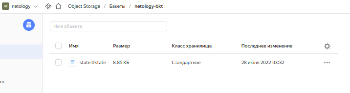

# Домашнее задание к занятию "7.3. Основы и принцип работы Терраформ"

## Задача 1. Создадим бэкэнд в S3 (необязательно, но крайне желательно).

Если в рамках предыдущего задания у вас уже есть аккаунт AWS, то давайте продолжим знакомство со взаимодействием
терраформа и aws. 

1. Создайте s3 бакет, iam роль и пользователя, от которого будет работать терраформ. Можно создать отдельного пользователя,
а можно использовать созданного в рамках предыдущего задания, просто добавьте ему необходимы права, как описано 
[здесь](https://www.terraform.io/docs/backends/types/s3.html).
2. Зарегистрируйте бэкэнд в терраформ проекте как описано по ссылке выше. 

## Решение.
1. [Инструкция по Я.Облаку](https://cloud.yandex.ru/docs/tutorials/infrastructure-management/terraform-state-storage). Для обхода проблем с блокировкой ПО на территории РФ, воспользуемся рекомендациями от Яндекс:
```bash
mike@make-lptp:~$ nano ~/.terraformrc
```
и добавим конфигурацию: 

```tf
provider_installation {
  network_mirror {
    url = "https://terraform-mirror.yandexcloud.net/"
    include = ["registry.terraform.io/*/*"]
  }
  direct {
    exclude = ["registry.terraform.io/*/*"]
  }
}
```
Инициируем:
```bash
mike@make-lptp:~/PycharmProjects/devops-netology/07-terraform-03-basic/src/terraform$ terraform init

Initializing the backend...

Initializing provider plugins...
- Finding yandex-cloud/yandex versions matching ">= 0.13.0"...
- Installing yandex-cloud/yandex v0.75.0...
- Installed yandex-cloud/yandex v0.75.0 (unauthenticated)

Terraform has created a lock file .terraform.lock.hcl to record the provider
selections it made above. Include this file in your version control repository
so that Terraform can guarantee to make the same selections by default when
you run "terraform init" in the future.

Terraform has been successfully initialized!

You may now begin working with Terraform. Try running "terraform plan" to see
any changes that are required for your infrastructure. All Terraform commands
should now work.

If you ever set or change modules or backend configuration for Terraform,
rerun this command to reinitialize your working directory. If you forget, other
commands will detect it and remind you to do so if necessary.

```
Создаем сервис-аккаунт:
```bash
mike@make-lptp:~/PycharmProjects/devops-netology/07-terraform-03-basic/src/terraform$ yc iam service-account create --name terraform
id: aje*********8
folder_id: b1**********
created_at: "2022-06-23T22:41:51.914518234Z"
name: terraform
```
Назначим роль editor
```bash
mike@make-lptp:~$ yc resource-manager folder add-access-binding b1******** --role editor --subject serviceAccount:aj****************
done (1s)
```
Создадим статический ключ доступа
```bash
mike@make-lptp:~$ yc iam access-key create --service-account-name terraform
access_key:
  id: ajev*********
  service_account_id: aje4**********
  created_at: "2022-06-25T22:07:38.764900100Z"
  key_id: YCAJ***************
secret: YCMY*****************
```


2. Регистрируем backend

В [provider.tf](./src/terraform/provider.tf) добавим конфигурацию S3:
```tf
terraform {
  required_providers {
    yandex = {
      source  = "yandex-cloud/yandex"
    }
  }
  # Backend settings
backend "s3" {
    endpoint   = "storage.yandexcloud.net"
    bucket     = "netology-bkt"
    region     = "ru-central1-a"
    key        = "./state.tfstate"
    access_key = "YCAJ*******"
    secret_key = "YCMG*******"

    skip_region_validation      = true
    skip_credentials_validation = true
}

}

```
Проинициализируем конфиг терраформ
```bash
mike@make-lptp:~/PycharmProjects/devops-netology/07-terraform-03-basic/src/terraform$ terraform init

Initializing the backend...

Initializing provider plugins...
- Reusing previous version of yandex-cloud/yandex from the dependency lock file
- Using previously-installed yandex-cloud/yandex v0.75.0

Terraform has been successfully initialized!

You may now begin working with Terraform. Try running "terraform plan" to see
any changes that are required for your infrastructure. All Terraform commands
should now work.

If you ever set or change modules or backend configuration for Terraform,
rerun this command to reinitialize your working directory. If you forget, other
commands will detect it and remind you to do so if necessary.

```
И построим план
```bash

```
```bash
mike@make-lptp:~/PycharmProjects/devops-netology/07-terraform-03-basic/src/terraform$ terraform plan

Terraform used the selected providers to generate the following execution plan.
Resource actions are indicated with the following symbols:
  + create

Terraform will perform the following actions:

  # yandex_compute_instance.vm-1 will be created
  + resource "yandex_compute_instance" "vm-1" {
      + created_at                = (known after apply)
      + folder_id                 = (known after apply)
      + fqdn                      = (known after apply)
      + hostname                  = (known after apply)
      + id                        = (known after apply)
      + metadata                  = {
          + "ssh-keys" = <<-EOT
                ubuntu:ssh-ed25519 AAAAC3NzaC1lZDI1NTE5AAAAIMMr/15yM5M5sBDbcJkZ/YWnZ4ET3xtnLiG7hmHAi8Mx kish_forever@bk.ru
            EOT
        }
      + name                      = "terraform1"
      + network_acceleration_type = "standard"
      + platform_id               = "standard-v1"
      + service_account_id        = (known after apply)
      + status                    = (known after apply)
      + zone                      = (known after apply)

      + boot_disk {
          + auto_delete = true
          + device_name = (known after apply)
          + disk_id     = (known after apply)
          + mode        = (known after apply)

          + initialize_params {
              + block_size  = (known after apply)
              + description = (known after apply)
              + image_id    = "fd87va5cc00gaq2f5qfb"
              + name        = (known after apply)
              + size        = (known after apply)
              + snapshot_id = (known after apply)
              + type        = "network-hdd"
            }
        }

      + network_interface {
          + index              = (known after apply)
          + ip_address         = (known after apply)
          + ipv4               = true
          + ipv6               = (known after apply)
          + ipv6_address       = (known after apply)
          + mac_address        = (known after apply)
          + nat                = true
          + nat_ip_address     = (known after apply)
          + nat_ip_version     = (known after apply)
          + security_group_ids = (known after apply)
          + subnet_id          = (known after apply)
        }

      + placement_policy {
          + host_affinity_rules = (known after apply)
          + placement_group_id  = (known after apply)
        }

      + resources {
          + core_fraction = 100
          + cores         = 2
          + memory        = 2
        }

      + scheduling_policy {
          + preemptible = (known after apply)
        }
    }

  # yandex_compute_instance.vm-2 will be created
  + resource "yandex_compute_instance" "vm-2" {
      + created_at                = (known after apply)
      + folder_id                 = (known after apply)
      + fqdn                      = (known after apply)
      + hostname                  = (known after apply)
      + id                        = (known after apply)
      + metadata                  = {
          + "ssh-keys" = <<-EOT
                ubuntu:ssh-ed25519 AAAAC3NzaC1lZDI1NTE5AAAAIMMr/15yM5M5sBDbcJkZ/YWnZ4ET3xtnLiG7hmHAi8Mx kish_forever@bk.ru
            EOT
        }
      + name                      = "terraform2"
      + network_acceleration_type = "standard"
      + platform_id               = "standard-v1"
      + service_account_id        = (known after apply)
      + status                    = (known after apply)
      + zone                      = (known after apply)

      + boot_disk {
          + auto_delete = true
          + device_name = (known after apply)
          + disk_id     = (known after apply)
          + mode        = (known after apply)

          + initialize_params {
              + block_size  = (known after apply)
              + description = (known after apply)
              + image_id    = "fd87va5cc00gaq2f5qfb"
              + name        = (known after apply)
              + size        = (known after apply)
              + snapshot_id = (known after apply)
              + type        = "network-hdd"
            }
        }

      + network_interface {
          + index              = (known after apply)
          + ip_address         = (known after apply)
          + ipv4               = true
          + ipv6               = (known after apply)
          + ipv6_address       = (known after apply)
          + mac_address        = (known after apply)
          + nat                = true
          + nat_ip_address     = (known after apply)
          + nat_ip_version     = (known after apply)
          + security_group_ids = (known after apply)
          + subnet_id          = (known after apply)
        }

      + placement_policy {
          + host_affinity_rules = (known after apply)
          + placement_group_id  = (known after apply)
        }

      + resources {
          + core_fraction = 100
          + cores         = 2
          + memory        = 4
        }

      + scheduling_policy {
          + preemptible = (known after apply)
        }
    }

  # yandex_vpc_network.network-1 will be created
  + resource "yandex_vpc_network" "network-1" {
      + created_at                = (known after apply)
      + default_security_group_id = (known after apply)
      + folder_id                 = (known after apply)
      + id                        = (known after apply)
      + labels                    = (known after apply)
      + name                      = "network1"
      + subnet_ids                = (known after apply)
    }

  # yandex_vpc_subnet.subnet-1 will be created
  + resource "yandex_vpc_subnet" "subnet-1" {
      + created_at     = (known after apply)
      + folder_id      = (known after apply)
      + id             = (known after apply)
      + labels         = (known after apply)
      + name           = "subnet1"
      + network_id     = (known after apply)
      + v4_cidr_blocks = [
          + "192.168.10.0/24",
        ]
      + v6_cidr_blocks = (known after apply)
      + zone           = "ru-central1-a"
    }

Plan: 4 to add, 0 to change, 0 to destroy.

Changes to Outputs:
  + external_ip_address_vm_1 = (known after apply)
  + external_ip_address_vm_2 = (known after apply)
  + internal_ip_address_vm_1 = (known after apply)
  + internal_ip_address_vm_2 = (known after apply)
  + subnet-1                 = (known after apply)

───────────────────────────────────────────────────────────────────────────────

Note: You didn't use the -out option to save this plan, so Terraform can't
guarantee to take exactly these actions if you run "terraform apply" now.
```
Получим образ актуальной системы:
```bash
mike@make-lptp:~$ yc compute image list --folder-id standard-images | grep ubuntu-20-04-lts
```
И добавим его в конфиг


## Задача 2. Инициализируем проект и создаем воркспейсы. 

1. Выполните `terraform init`:
    * если был создан бэкэнд в S3, то терраформ создаст файл стейтов в S3 и запись в таблице 
dynamodb.
    * иначе будет создан локальный файл со стейтами.  
2. Создайте два воркспейса `stage` и `prod`.
3. В уже созданный `aws_instance` добавьте зависимость типа инстанса от воркспейса, чтобы в разных ворскспейсах 
использовались разные `instance_type`.
4. Добавим `count`. Для `stage` должен создаться один экземпляр `ec2`, а для `prod` два. 
5. Создайте рядом еще один `aws_instance`, но теперь определите их количество при помощи `for_each`, а не `count`.
6. Что бы при изменении типа инстанса не возникло ситуации, когда не будет ни одного инстанса добавьте параметр
жизненного цикла `create_before_destroy = true` в один из ресурсов `aws_instance`.
7. При желании поэкспериментируйте с другими параметрами и ресурсами.


## Решение

1. Выполните `terraform init`:
Выполнили `terraform apply`. 
```bash
yandex_compute_instance.vm-1: Creating...
yandex_compute_instance.vm-2: Creating...
yandex_compute_instance.vm-1: Still creating... [10s elapsed]
yandex_compute_instance.vm-2: Still creating... [10s elapsed]
yandex_compute_instance.vm-1: Still creating... [20s elapsed]
yandex_compute_instance.vm-2: Still creating... [20s elapsed]
yandex_compute_instance.vm-1: Creation complete after 25s [id=fhmkn0tqk4mditqq0vl8]
yandex_compute_instance.vm-2: Creation complete after 26s [id=fhmpt8j4u80c2t3e0e10]

Apply complete! Resources: 2 added, 0 changed, 0 destroyed.
```

B backet был создан файл бэкэнда:



  
2. Создайте два воркспейса `stage` и `prod`.

```bash
mike@make-lptp:~/PycharmProjects/devops-netology/07-terraform-03-basic/src/terraform$ terraform workspace new prod
Created and switched to workspace "prod"!

You're now on a new, empty workspace. Workspaces isolate their state,
so if you run "terraform plan" Terraform will not see any existing state
for this configuration.
mike@make-lptp:~/PycharmProjects/devops-netology/07-terraform-03-basic/src/terraform$ terraform workspace new stage
Created and switched to workspace "stage"!

You're now on a new, empty workspace. Workspaces isolate their state,
so if you run "terraform plan" Terraform will not see any existing state
for this configuration.
```

3. В уже созданный `aws_instance` добавьте зависимость типа инстанса от воркспейса, чтобы в разных ворскспейсах 
использовались разные `instance_type`.

```bash
locals {
  yc_instance_type_map = {
       stage = "standard-v1"
       prod = "standard-v2"
     }
```
4. Добавим `count`. Для `stage` должен создаться один экземпляр `ec2`, а для `prod` два.
```bash

```
5. Создайте рядом еще один `aws_instance`, но теперь определите их количество при помощи `for_each`, а не `count`.

```bash

```
6. Что бы при изменении типа инстанса не возникло ситуации, когда не будет ни одного инстанса добавьте параметр
жизненного цикла `create_before_destroy = true` в один из ресурсов `aws_instance`.

```bash

```
7. При желании поэкспериментируйте с другими параметрами и ресурсами.


В виде результата работы пришлите:
* Вывод команды `terraform workspace list`.
* Вывод команды `terraform plan` для воркспейса `prod`.  


## Решение.

---

### Как cдавать задание

Выполненное домашнее задание пришлите ссылкой на .md-файл в вашем репозитории.

---