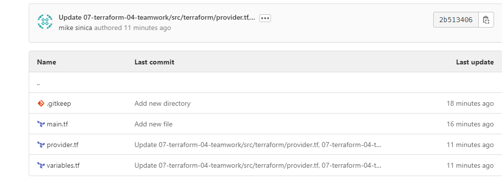
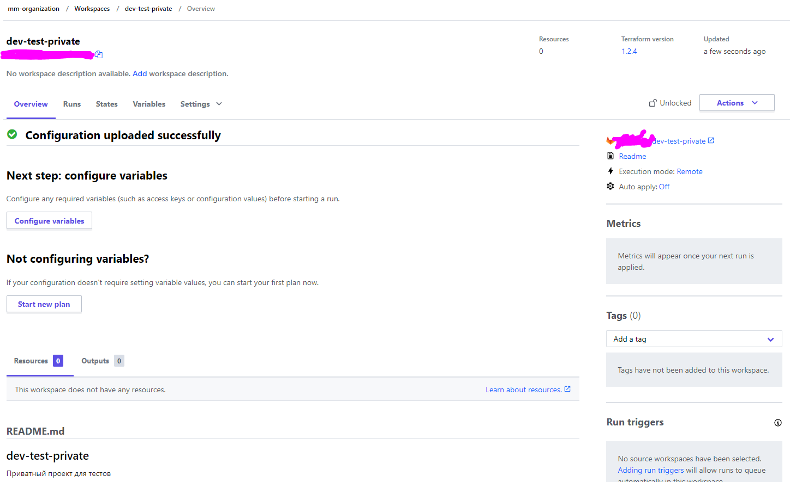
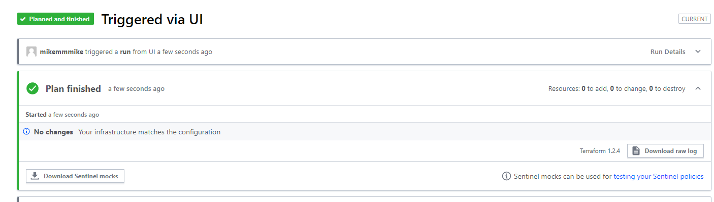

# Домашнее задание к занятию "7.4. Средства командной работы над инфраструктурой."

## Задача 1. Настроить terraform cloud (необязательно, но крайне желательно).

В это задании предлагается познакомиться со средством командой работы над инфраструктурой предоставляемым
разработчиками терраформа. 

1. Зарегистрируйтесь на [https://app.terraform.io/](https://app.terraform.io/).
(регистрация бесплатная и не требует использования платежных инструментов).
2. Создайте в своем github аккаунте (или другом хранилище репозиториев) отдельный репозиторий с
 конфигурационными файлами прошлых занятий (или воспользуйтесь любым простым конфигом).
3. Зарегистрируйте этот репозиторий в [https://app.terraform.io/](https://app.terraform.io/).
4. Выполните plan и apply. 

В качестве результата задания приложите снимок экрана с успешным применением конфигурации.

## Решение
1. Готово. Подключил по [инструкции](https://www.terraform.io/cloud-docs/vcs/gitlab-com) репозиторий GitLab
2. Готово. создал приватный репозиторий, т.к. в нем хранятся идентификаторы доступа к облаку  
3. Сделано. 
4. Готово. 


## Задача 2. Написать серверный конфиг для атлантиса. 

Смысл задания – познакомиться с документацией 
о [серверной](https://www.runatlantis.io/docs/server-side-repo-config.html) конфигурации и конфигурации уровня 
 [репозитория](https://www.runatlantis.io/docs/repo-level-atlantis-yaml.html).

Создай `server.yaml` который скажет атлантису:
1. Укажите, что атлантис должен работать только для репозиториев в вашем github (или любом другом) аккаунте.
2. На стороне клиентского конфига разрешите изменять `workflow`, то есть для каждого репозитория можно 
будет указать свои дополнительные команды. 
3. В `workflow` используемом по-умолчанию сделайте так, что бы во время планирования не происходил `lock` состояния.

Создай `atlantis.yaml` который, если поместить в корень terraform проекта, скажет атлантису:
1. Надо запускать планирование и аплай для двух воркспейсов `stage` и `prod`.
2. Необходимо включить автопланирование при изменении любых файлов `*.tf`.

В качестве результата приложите ссылку на файлы `server.yaml` и `atlantis.yaml`.


## Решение

* `server.yaml`
1. Репозиторий:
```yml
  repos:
  - id: gitlab.com/mikezzzz/dev-test-private
    apply_requirements: [approved]
    workflow: default
```
2. Изменение workflow на стороне клиентского конфига, строка `allowed_overrides: [workflow]`:
```yaml
repos:
  - id: github.com/AlexDies/homework
    apply_requirements: [approved]
    workflow: default
    allowed_overrides: [workflow]
```
3. Отключение `lock` состояния workflow по-умолчанию:
```yaml
# atlantis.yaml or repos.yaml
workflows:
  myworkflow:
    plan:
      steps:
      - init:
          extra_args: ["-lock=false"]
      - plan:
          extra_args: ["-lock=false"]
    apply:
      steps:
      - apply:
          extra_args: ["-lock=false"]
```

* `atlantis.yaml`
1. Plan&Apply для stage и prod:
```yaml
version: 3
  projects:
  - dir: .
    workspace: stage
    terraform_version: v0.13.0
    workflow: default
  - dir: .
    workspace: prod
    terraform_version: v0.13.0  
    workflow: default
    
  workflows:
     default:
        plan:
           steps:
              - init: 
                 extra_args: ["-lock=false"]
              - plan:
                 extra_args: ["-lock=false"]
        apply:
           steps: 
              - apply:
                 extra_args: ["-lock=false"]
```
2. Автопланирование при изменении любых файлов *.tf - `autoplan: when_modified: ["*.tf*"]`:
```yaml
version: 3
  projects:
  - dir: .
    workspace: stage
    terraform_version: v0.13.0
    workflow: default
    autoplan:
      when_modified: ["*.tf*"]
  - dir: .
    workspace: prod
    terraform_version: v0.13.0  
    workflow: default
    autoplan:
      when_modified: ["*.tf*"]
    
```
Cсылки на файлы:

* [server.yaml](./src/server.yaml)

* [atlantis.yaml](./src/atlantis.yaml)


## Задача 3. Знакомство с каталогом модулей. 

1. В [каталоге модулей](https://registry.terraform.io/browse/modules) найдите официальный модуль от aws для создания
`ec2` инстансов. 
2. Изучите как устроен модуль. Задумайтесь, будете ли в своем проекте использовать этот модуль или непосредственно 
ресурс `aws_instance` без помощи модуля?
3. В рамках предпоследнего задания был создан ec2 при помощи ресурса `aws_instance`. 
Создайте аналогичный инстанс при помощи найденного модуля.   

В качестве результата задания приложите ссылку на созданный блок конфигураций. 


## Решение

1. В я.облаке функционал, подобный ec2 от aws, предоставляет модуль [yandex_compute_instance_group](https://registry.tfpla.net/providers/yandex-cloud/yandex/latest/docs/resources/compute_instance_group) - компонент Compute Cloud, который позволяет создавать 
группы экземпляров и управлять ими.
2. Данный модуль подойдет для решения своих задач. При помощи yandex_compute_instance_group можно создать требуемое количество инстансов, указав количество в параметрах модуля. Также при помощи модуля 
можно настроить аторазвертывание инстансов при росте нагрузки на сервис\падении сервиса. В общем, модуль имеет смысл использовать, когда требуется решить задачу развертывания большого количества однотипных ВМ. 
Когда требуется создать пару ВМ, необходимости использовать `yandex_compute_instance_group` нет, т.к. настройки модуля `yandex_compute_instance` более гибкие. в общем, ответ на этот вопрос зависит от задачи.
3. 


---

### Как cдавать задание

Выполненное домашнее задание пришлите ссылкой на .md-файл в вашем репозитории.

---