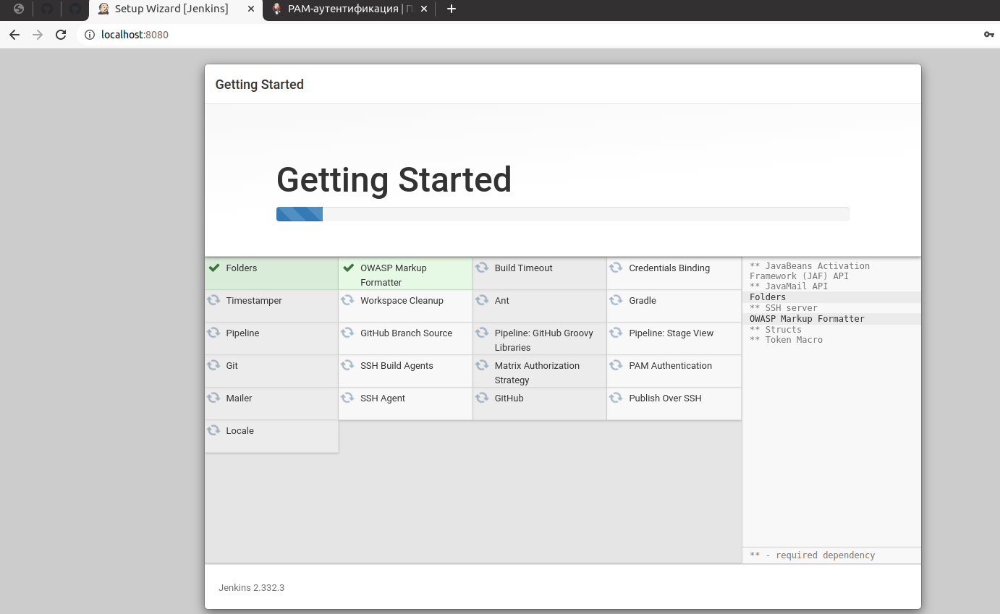
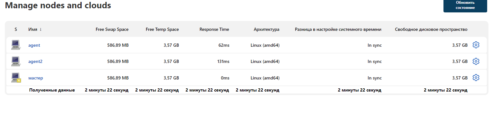
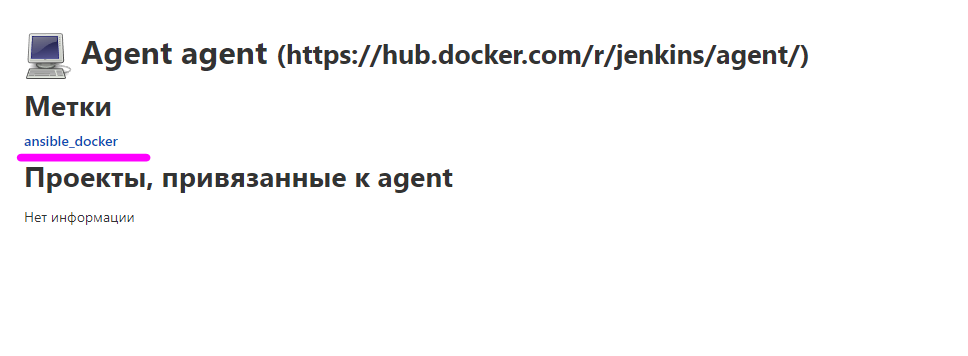

# Домашнее задание к занятию "09.03 Jenkins"

## Подготовка к выполнению

1. Установить jenkins по любой из [инструкций](https://www.jenkins.io/download/)
2. Запустить и проверить работоспособность
3. Сделать первоначальную настройку
4. Настроить под свои нужды
5. Поднять отдельный cloud
6. Для динамических агентов можно использовать [образ](https://hub.docker.com/repository/docker/aragast/agent)
7. Обязательный параметр: поставить label для динамических агентов: `ansible_docker`
8.  Сделать форк репозитория с [playbook](https://github.com/aragastmatb/example-playbook)

### Лог
1. Установка Jenkins на Ubuntu
```bash
02:40:40 j0 mike@mike-VirtualBox:~/devops/09-ci-03-jenkins
$ curl -fsSL https://pkg.jenkins.io/debian-stable/jenkins.io.key | sudo tee \
> /usr/share/keyrings/jenkins-keyring.asc > /dev/null
[sudo] пароль для mike: 
02:40:58 j0 mike@mike-VirtualBox:~/devops/09-ci-03-jenkins
$ echo deb [signed-by=/usr/share/keyrings/jenkins-keyring.asc] \
>     https://pkg.jenkins.io/debian-stable binary/ | sudo tee \
>     /etc/apt/sources.list.d/jenkins.list > /dev/null
02:41:10 j0 mike@mike-VirtualBox:~/devops/09-ci-03-jenkins
$ sudo apt-get update
02:41:30 j0 mike@mike-VirtualBox:~/devops/09-ci-03-jenkins
$ sudo apt-get install fontconfig openjdk-11-jre
02:41:36 j0 mike@mike-VirtualBox:~/devops/09-ci-03-jenkins
$ sudo apt-get install jenkins
```
2. Проверка работоспособности:
```bash
02:50:21 j0 mike@mike-VirtualBox:~/devops/09-ci-03-jenkins
$ curl localhost:8080
<html><head><meta http-equiv='refresh' content='1;url=/login?from=%2F'/><script>window.location.replace('/login?from=%2F');</script></head><body style='background-color:white; color:white;'>


Authentication required
<!--
-->

</body></html> 
```
3. Настройка.

Получаем пароль
```bash
$ sudo cat /var/lib/jenkins/secrets/initialAdminPassword
ae7343fe7a364f81b71eef5dc3b0ca4d
```
Залогинились. Установили плагины:



4. Dashboard - Настройка - Сменили количество сборщиков с 2 на 0 на  Мастере. 

5,6.  Настраиваем агентов. Не смог разобраться как использовать [образ](https://hub.docker.com/repository/docker/aragast/agent) для динамических агентов:
 
```bash
[06/15/22 02:35:02] Launching agent
$ docker run -i --rm --name agent3 --init  aragast/agent:7 java -jar /usr/share/jenkins/agent.jar
Error: Unable to access jarfile /usr/share/jenkins/agent.jar
ERROR: Unable to launch the agent for Agent_test
java.io.EOFException: unexpected stream termination
	at hudson.remoting.ChannelBuilder.negotiate(ChannelBuilder.java:459)
	at hudson.remoting.ChannelBuilder.build(ChannelBuilder.java:404)
	at hudson.slaves.SlaveComputer.setChannel(SlaveComputer.java:436)
	at hudson.slaves.CommandLauncher.launch(CommandLauncher.java:170)
	at hudson.slaves.SlaveComputer.lambda$_connect$0(SlaveComputer.java:297)
	at jenkins.util.ContextResettingExecutorService$2.call(ContextResettingExecutorService.java:46)
	at jenkins.security.ImpersonatingExecutorService$2.call(ImpersonatingExecutorService.java:80)
	at java.base/java.util.concurrent.FutureTask.run(FutureTask.java:264)
	at java.base/java.util.concurrent.ThreadPoolExecutor.runWorker(ThreadPoolExecutor.java:1128)
	at java.base/java.util.concurrent.ThreadPoolExecutor$Worker.run(ThreadPoolExecutor.java:628)
	at java.base/java.lang.Thread.run(Thread.java:829)
ERROR: Process terminated with exit code 1
```

Пошел по пути использования [официального докер-образа](https://hub.docker.com/r/jenkins/agent/. 
Агент запускается мастером при помощи команды `docker run -i --rm --name agent --init jenkins/agent java -jar /usr/share/jenkins/agent.jar`. Рискну предположить, что в образе не будет необходимых пакетов - bind-utils, gcc, git, python, python-psutil, python-devel, python-pip, python-virtualenv, openssl-devel, libselinux-python, nmap-ncat, возможно buildkit. Но эту проблему решу несколько позже, т.к. на то, чтобы разобраться с запуском агентов, потратил значительное количество времени.  

Результат:



7. метка установлена:


8. Форк репозитория с [playbook сделал](https://github.com/mikeMMmike/example-playbook)

## Основная часть

1. Сделать Freestyle Job, который будет запускать `ansible-playbook` из форка репозитория
2. Сделать Declarative Pipeline, который будет выкачивать репозиторий с плейбукой и запускать её
3. Перенести Declarative Pipeline в репозиторий в файл `Jenkinsfile`
4. Перенастроить Job на использование `Jenkinsfile` из репозитория
5. Создать Scripted Pipeline, наполнить его скриптом из [pipeline](./pipeline)
6. Заменить credentialsId на свой собственный
7. Проверить работоспособность, исправить ошибки, исправленный Pipeline вложить в репозитрий в файл `ScriptedJenkinsfile`
8. Отправить ссылку на репозиторий в ответе

## Лог
1. Сделать Freestyle Job, который будет запускать `ansible-playbook` из форка репозитория.

Добавил credential для подключения к GitHub.
Создаем Задачу со свободной конфигурацией:


## Необязательная часть

1. Создать скрипт на groovy, который будет собирать все Job, которые завершились хотя бы раз неуспешно. Добавить скрипт в репозиторий с решеним с названием `AllJobFailure.groovy`
2. Установить customtools plugin
3. Поднять инстанс с локальным nexus, выложить туда в анонимный доступ  .tar.gz с `ansible`  версии 2.9.x
4. Создать джобу, которая будет использовать `ansible` из `customtool`
5. Джоба должна просто исполнять команду `ansible --version`, в ответ прислать лог исполнения джобы 

---

### Как оформить ДЗ?

Выполненное домашнее задание пришлите ссылкой на .md-файл в вашем репозитории.

---