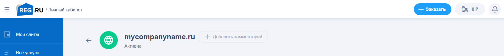
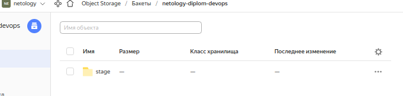
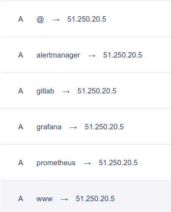
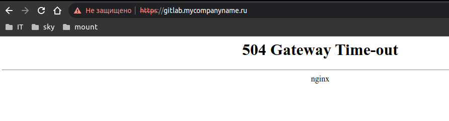
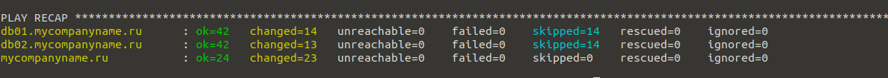

# Дипломный практикум в YandexCloud
  * [Цели:](#цели)
  * [Этапы выполнения:](#этапы-выполнения)
      * [Регистрация доменного имени](#регистрация-доменного-имени)
      * [Создание инфраструктуры](#создание-инфраструктуры)
          * [Установка Nginx и LetsEncrypt](#установка-nginx)
          * [Установка кластера MySQL](#установка-mysql)
          * [Установка WordPress](#установка-wordpress)
          * [Установка Gitlab CE, Gitlab Runner и настройка CI/CD](#установка-gitlab)
          * [Установка Prometheus, Alert Manager, Node Exporter и Grafana](#установка-prometheus)
  * [Что необходимо для сдачи задания?](#что-необходимо-для-сдачи-задания)
  * [Как правильно задавать вопросы дипломному руководителю?](#как-правильно-задавать-вопросы-дипломному-руководителю)

---
## Цели:

1. Зарегистрировать доменное имя (любое на ваш выбор в любой доменной зоне).
2. Подготовить инфраструктуру с помощью Terraform на базе облачного провайдера YandexCloud.
3. Настроить внешний Reverse Proxy на основе Nginx и LetsEncrypt.
4. Настроить кластер MySQL.
5. Установить WordPress.
6. Развернуть Gitlab CE и Gitlab Runner.
7. Настроить CI/CD для автоматического развёртывания приложения.
8. Настроить мониторинг инфраструктуры с помощью стека: Prometheus, Alert Manager и Grafana.

---
## Этапы выполнения:

### Регистрация доменного имени

Подойдет любое доменное имя на ваш выбор в любой доменной зоне.

ПРИМЕЧАНИЕ: Далее в качестве примера используется домен `you.domain` замените его вашим доменом.

Рекомендуемые регистраторы:
  - [nic.ru](https://nic.ru)
  - [reg.ru](https://reg.ru)

Цель:

1. Получить возможность выписывать [TLS сертификаты](https://letsencrypt.org) для веб-сервера.

Ожидаемые результаты:

1. У вас есть доступ к личному кабинету на сайте регистратора.
2. Вы зарезистрировали домен и можете им управлять (редактировать dns записи в рамках этого домена).

### Создание инфраструктуры

Для начала необходимо подготовить инфраструктуру в YC при помощи [Terraform](https://www.terraform.io/).

Особенности выполнения:

- Бюджет купона ограничен, что следует иметь в виду при проектировании инфраструктуры и использовании ресурсов;
- Следует использовать последнюю стабильную версию [Terraform](https://www.terraform.io/).

Предварительная подготовка:

1. Создайте сервисный аккаунт, который будет в дальнейшем использоваться Terraform для работы с инфраструктурой с необходимыми и достаточными правами. Не стоит использовать права суперпользователя
2. Подготовьте [backend](https://www.terraform.io/docs/language/settings/backends/index.html) для Terraform:
   а. Рекомендуемый вариант: [Terraform Cloud](https://app.terraform.io/)  
   б. Альтернативный вариант: S3 bucket в созданном YC аккаунте.
3. Настройте [workspaces](https://www.terraform.io/docs/language/state/workspaces.html)
   а. Рекомендуемый вариант: создайте два workspace: *stage* и *prod*. В случае выбора этого варианта все последующие шаги должны учитывать факт существования нескольких workspace.  
   б. Альтернативный вариант: используйте один workspace, назвав его *stage*. Пожалуйста, не используйте workspace, создаваемый Terraform-ом по-умолчанию (*default*).
4. Создайте VPC с подсетями в разных зонах доступности.
5. Убедитесь, что теперь вы можете выполнить команды `terraform destroy` и `terraform apply` без дополнительных ручных действий.
6. В случае использования [Terraform Cloud](https://app.terraform.io/) в качестве [backend](https://www.terraform.io/docs/language/settings/backends/index.html) убедитесь, что применение изменений успешно проходит, используя web-интерфейс Terraform cloud.

Цель:

1. Повсеместно применять IaaC подход при организации (эксплуатации) инфраструктуры.
2. Иметь возможность быстро создавать (а также удалять) виртуальные машины и сети. С целью экономии денег на вашем аккаунте в YandexCloud.

Ожидаемые результаты:

1. Terraform сконфигурирован и создание инфраструктуры посредством Terraform возможно без дополнительных ручных действий.
2. Полученная конфигурация инфраструктуры является предварительной, поэтому в ходе дальнейшего выполнения задания возможны изменения.

---
### Установка Nginx и LetsEncrypt

Необходимо разработать Ansible роль для установки Nginx и LetsEncrypt.

**Для получения LetsEncrypt сертификатов во время тестов своего кода пользуйтесь [тестовыми сертификатами](https://letsencrypt.org/docs/staging-environment/), так как количество запросов к боевым серверам LetsEncrypt [лимитировано](https://letsencrypt.org/docs/rate-limits/).**

Рекомендации:
  - Имя сервера: `you.domain`
  - Характеристики: 2vCPU, 2 RAM, External address (Public) и Internal address.

Цель:

1. Создать reverse proxy с поддержкой TLS для обеспечения безопасного доступа к веб-сервисам по HTTPS.

Ожидаемые результаты:

1. В вашей доменной зоне настроены все A-записи на внешний адрес этого сервера:
    - `https://www.you.domain` (WordPress)
    - `https://gitlab.you.domain` (Gitlab)
    - `https://grafana.you.domain` (Grafana)
    - `https://prometheus.you.domain` (Prometheus)
    - `https://alertmanager.you.domain` (Alert Manager)
2. Настроены все upstream для выше указанных URL, куда они сейчас ведут на этом шаге не важно, позже вы их отредактируете и укажите верные значения.
3. В браузере можно открыть любой из этих URL и увидеть ответ сервера (502 Bad Gateway). На текущем этапе выполнение задания это нормально!

___
### Установка кластера MySQL

Необходимо разработать Ansible роль для установки кластера MySQL.

Рекомендации:
  - Имена серверов: `db01.you.domain` и `db02.you.domain`
  - Характеристики: 4vCPU, 4 RAM, Internal address.

Цель:

1. Получить отказоустойчивый кластер баз данных MySQL.

Ожидаемые результаты:

1. MySQL работает в режиме репликации Master/Slave.
2. В кластере автоматически создаётся база данных c именем `wordpress`.
3. В кластере автоматически создаётся пользователь `wordpress` с полными правами на базу `wordpress` и паролем `wordpress`.

**Вы должны понимать, что в рамках обучения это допустимые значения, но в боевой среде использование подобных значений не приемлимо! Считается хорошей практикой использовать логины и пароли повышенного уровня сложности. В которых будут содержаться буквы верхнего и нижнего регистров, цифры, а также специальные символы!**

___
### Установка WordPress

Необходимо разработать Ansible роль для установки WordPress.

Рекомендации:
  - Имя сервера: `app.you.domain`
  - Характеристики: 4vCPU, 4 RAM, Internal address.

Цель:

1. Установить [WordPress](https://wordpress.org/download/). Это система управления содержимым сайта ([CMS](https://ru.wikipedia.org/wiki/Система_управления_содержимым)) с открытым исходным кодом.


По данным W3techs, WordPress используют 64,7% всех веб-сайтов, которые сделаны на CMS. Это 41,1% всех существующих в мире сайтов. Эту платформу для своих блогов используют The New York Times и Forbes. Такую популярность WordPress получил за удобство интерфейса и большие возможности.

Ожидаемые результаты:

1. Виртуальная машина, на которой установлен WordPress и Nginx/Apache (на ваше усмотрение).
2. В вашей доменной зоне настроена A-запись на внешний адрес reverse proxy:
    - `https://www.you.domain` (WordPress)
3. На сервере `you.domain` отредактирован upstream для выше указанного URL и он смотрит на виртуальную машину на которой установлен WordPress.
4. В браузере можно открыть URL `https://www.you.domain` и увидеть главную страницу WordPress.
---
### Установка Gitlab CE и Gitlab Runner

Необходимо настроить CI/CD систему для автоматического развертывания приложения при изменении кода.

Рекомендации:
  - Имена серверов: `gitlab.you.domain` и `runner.you.domain`
  - Характеристики: 4vCPU, 4 RAM, Internal address.

Цель:
1. Построить pipeline доставки кода в среду эксплуатации, то есть настроить автоматический деплой на сервер `app.you.domain` при коммите в репозиторий с WordPress.

Подробнее о [Gitlab CI](https://about.gitlab.com/stages-devops-lifecycle/continuous-integration/)

Ожидаемый результат:

1. Интерфейс Gitlab доступен по https.
2. В вашей доменной зоне настроена A-запись на внешний адрес reverse proxy:
    - `https://gitlab.you.domain` (Gitlab)
3. На сервере `you.domain` отредактирован upstream для выше указанного URL и он смотрит на виртуальную машину на которой установлен Gitlab.
4. При любом коммите в репозиторий с WordPress и создании тега (например, v1.0.0) происходит деплой на виртуальную машину.

___
### Установка Prometheus, Alert Manager, Node Exporter и Grafana

Необходимо разработать Ansible роль для установки Prometheus, Alert Manager и Grafana.

Рекомендации:
  - Имя сервера: `monitoring.you.domain`
  - Характеристики: 4vCPU, 4 RAM, Internal address.

Цель:

1. Получение метрик со всей инфраструктуры.

Ожидаемые результаты:

1. Интерфейсы Prometheus, Alert Manager и Grafana доступны по https.
2. В вашей доменной зоне настроены A-записи на внешний адрес reverse proxy:
  - `https://grafana.you.domain` (Grafana)
  - `https://prometheus.you.domain` (Prometheus)
  - `https://alertmanager.you.domain` (Alert Manager)
3. На сервере `you.domain` отредактированы upstreams для выше указанных URL и они смотрят на виртуальную машину на которой установлены Prometheus, Alert Manager и Grafana.
4. На всех серверах установлен Node Exporter и его метрики доступны Prometheus.
5. У Alert Manager есть необходимый [набор правил](https://awesome-prometheus-alerts.grep.to/rules.html) для создания алертов.
6. В Grafana есть дашборд, отображающий метрики из Node Exporter по всем серверам.
7. В Grafana есть дашборд, отображающий метрики из MySQL (*).
8. В Grafana есть дашборд, отображающий метрики из WordPress (*).

*Примечание: дашборды со звёздочкой являются опциональными заданиями повышенной сложности их выполнение желательно, но не обязательно.*

---
## Что необходимо для сдачи задания?

1. Репозиторий со всеми Terraform манифестами и готовность продемонстрировать создание всех ресурсов с нуля.
2. Репозиторий со всеми Ansible ролями и готовность продемонстрировать установку всех сервисов с нуля.
3. Скриншоты веб-интерфейсов всех сервисов работающих по HTTPS на вашем доменном имени.
  - `https://www.you.domain` (WordPress)
  - `https://gitlab.you.domain` (Gitlab)
  - `https://grafana.you.domain` (Grafana)
  - `https://prometheus.you.domain` (Prometheus)
  - `https://alertmanager.you.domain` (Alert Manager)
4. Все репозитории рекомендуется хранить на одном из ресурсов ([github.com](https://github.com) или [gitlab.com](https://gitlab.com)).

---
## Как правильно задавать вопросы дипломному руководителю?

**Что поможет решить большинство частых проблем:**

    
1. Попробовать найти ответ сначала самостоятельно в интернете или в
  материалах курса и ДЗ и только после этого спрашивать у дипломного
  руководителя. Навык поиска ответов пригодится вам в профессиональной
  деятельности.
2. Если вопросов больше одного, то присылайте их в виде нумерованного
  списка. Так дипломному руководителю будет проще отвечать на каждый из
  них.
3. При необходимости прикрепите к вопросу скриншоты и стрелочкой
  покажите, где не получается.

**Что может стать источником проблем:**

1. Вопросы вида «Ничего не работает. Не запускается. Всё сломалось». Дипломный руководитель не сможет ответить на такой вопрос без дополнительных уточнений. Цените своё время и время других.
2. Откладывание выполнения курсового проекта на последний момент.
3. Ожидание моментального ответа на свой вопрос. Дипломные руководители работающие разработчики, которые занимаются, кроме преподавания, своими проектами. Их время ограничено, поэтому постарайтесь задавать правильные вопросы, чтобы получать быстрые ответы :)


### 1. Зарегистрировать доменное имя (любое на ваш выбор в любой доменной зоне).
Зарегистрировали доменное имя в https://www.reg.ru/


### 2. Создание инфраструктуры

Предварительная подготовка:

1. [Создайте сервисный аккаунт](https://cloud.yandex.ru/docs/iam/operations/sa/create), который будет в дальнейшем использоваться Terraform для работы с инфраструктурой с необходимыми и достаточными правами. Не стоит использовать права суперпользователя

Создаем сервис-аккаунт:
```bash
mike@make-lptp:~/PycharmProjects/devops-netology/devops-diplom-yandexcloud/src/terraform$ yc iam service-account create --name netology-diplom
id: aje
folder_id: b1g
created_at: "2022-07-10T23:25:39.773508008Z"
name: netology-diplom

```
Назначим роль editor
```bash
mike@make-lptp:~/PycharmProjects/devops-netology/devops-diplom-yandexcloud/src/terraform$ yc resource-manager folder add-access-binding b1g3**** --role editor --subject serviceAccount:aje****
done (1s)
```
Создадим статический ключ доступа
```bash
mike@make-lptp:~/PycharmProjects/devops-netology/devops-diplom-yandexcloud/src/terraform$ yc iam access-key create --service-account-name netology-diplom
access_key:
  id: aje****
  service_account_id: aje****
  created_at: "2022-07-10T23:32:28.323165040Z"
  key_id: YCA****
secret: YCM****
```

2. Подготовьте [backend](https://www.terraform.io/docs/language/settings/backends/index.html) для Terraform. Остановим выбор на альтернативном варианте:  [S3 bucket в созданном YC аккаунте](https://cloud.yandex.ru/docs/storage/operations/buckets/create).
Создали бакет в YC:



Конфигурация содержится в файле [provider.tf](./src/terraform/provider.tf):

```terraform
backend "s3" {
  endpoint = "storage.yandexcloud.net"
  bucket   = "netology-diplom-devops"
  region   = "ru-central1"
  key      = "stage/terraform-stage.tfstate"

  skip_region_validation      = true
  skip_credentials_validation = true
}
```

3. Настройте [workspaces](https://www.terraform.io/docs/language/state/workspaces.html)
   * Рекомендуемый вариант: создайте два workspace: *stage* и *prod*. В случае выбора этого варианта все последующие шаги должны учитывать факт существования нескольких workspace.  
   * Альтернативный вариант: используйте один workspace, назвав его *stage*. Пожалуйста, не используйте workspace, создаваемый Terraform-ом по-умолчанию (*default*).


Создаем workspaces `prod` и `stage`:

```bash 
mike@make-lptp:~/PycharmProjects/devops-netology/devops-diplom-yandexcloud/src/terraform$ terraform workspace new prod
Created and switched to workspace "prod"!

You're now on a new, empty workspace. Workspaces isolate their state,
so if you run "terraform plan" Terraform will not see any existing state
for this configuration.
mike@make-lptp:~/PycharmProjects/devops-netology/devops-diplom-yandexcloud/src/terraform$ terraform workspace new stage
Created and switched to workspace "stage"!

You're now on a new, empty workspace. Workspaces isolate their state,
so if you run "terraform plan" Terraform will not see any existing state
for this configuration.
```

Проверяем наличие созданных workspace. Присутствуют:
```bash
mike@make-lptp:~/PycharmProjects/devops-netology/devops-diplom-yandexcloud/src/terraform$ terraform workspace list
  default
  prod
* stage
```

4. Создайте VPC с подсетями в разных зонах доступности.
Подготовили tf. файлы: 
* `node01.tf`
```terraform
resource "yandex_compute_instance" "test-server" {
  name = "testserver"
  platform_id = local.yc_instance_type_map[terraform.workspace]
  count = local.yc_instance_count[terraform.workspace]
  zone = local.vpc_zone[terraform.workspace]
  resources {
    cores  = local.yc_cores[terraform.workspace]
    memory = local.yc_mem[terraform.workspace]
      }
  boot_disk {
    initialize_params {
      image_id = "fd8f1tik9a7ap9ik2dg1"
      size = local.yc_disk_size[terraform.workspace]
    }
  }
  network_interface {
    subnet_id = yandex_vpc_subnet.yc_subnet.id
    /*yandex_vpc_network.yc_network.id*/
    nat       = true
  }
  metadata = {
    ssh-keys = "ubuntu:${file("~/.ssh/id_rsa.pub")}"
  }
}
```
* `locals.tf`
```terraform
locals {
  yc_instance_type_map = {
    stage = "standard-v1"
    prod  = "standard-v2"
  }
  yc_cores = {
    stage = 2
    prod  = 4
  }
  yc_disk_size = {
    stage = 10
    prod  = 20
  }
  yc_instance_count = {
    stage = 1
    prod  = 1
  }
  yc_mem = {
    stage = 4
    prod  = 8
  }
  vpc_zone = {
    stage = "ru-central1-a"
    prod  = "ru-central1-b"
  }
  vpc_subnets_v4-cidr = {
    stage = ["10.128.0.0/24"]
    prod  = ["10.128.0.0/24", "10.129.0.0/24"]
  }
}
```
* `network.tf`
```terraform
resource "yandex_vpc_network" "yc_network" {
  name = "vpc-network-${terraform.workspace}"
  }
resource "yandex_vpc_subnet" "yc_subnet" {
  name           = "yc_subnet"
  zone           = local.vpc_zone[terraform.workspace]
  network_id     = yandex_vpc_network.yc_network.id
  v4_cidr_blocks = local.vpc_subnets_v4-cidr[terraform.workspace]
}
```

5. Убедитесь, что теперь вы можете выполнить команды `terraform destroy` и `terraform apply` без дополнительных ручных действий.
Все работает за рядом исключений. Чтобы не светить ключи, необходимо экспортировать переменные перед инициализацией терраформ:

```bash 
 export AWS_ACCESS_KEY_ID=Ключ доступа
 export AWS_SECRET_ACCESS_KEY=Секретный ключ
```
Также возникают проблемы при использовании workspace, если инстансов более 1. Терраформ инит проходит успешно, но при терраформ аплай яндекс рапортует об ошибке, что имя инстанса уже существует.
Если добавить в имя [conunt.index], возникнет ошибка цикла даже на стадии терраформ план. можно, конечно, имя не определять. в таком случае имя сервера сгенерируется автоматически и будет неудобным для восприятия человеком.
```terraform 
resource "yandex_compute_instance" "test-server" {
  name = "testserver"
  # вот уж не знаю,почему, но при count >= 2 появляется ошибка. YC ругается на не верное имя:
  # rpc error: code = InvalidArgument desc = Request validation error: Name: invalid resource name
  #поэтому все варианты, что ниже,закомменчены, имя захардкожено и count в locals равняется 1. решения на 17.07.22 не нашел
  /*name = "${var.name}-${format(var.count_format, var.count_offset+count.index+1)}"*/
  /*name = "test-server-[${count.index+1}]"*/
```


6. В случае использования [Terraform Cloud](https://app.terraform.io/) в качестве [backend](https://www.terraform.io/docs/language/settings/backends/index.html) убедитесь, что применение изменений успешно проходит, используя web-интерфейс Terraform cloud.

Terraform cloud не использовали. Данный пункт нет необходимости проверять.

Цель:

1. Повсеместно применять IaaC подход при организации (эксплуатации) инфраструктуры.
2. Иметь возможность быстро создавать (а также удалять) виртуальные машины и сети. С целью экономии денег на вашем аккаунте в YandexCloud.

Ожидаемые результаты:

1. Terraform сконфигурирован и создание инфраструктуры посредством Terraform возможно без дополнительных ручных действий.
2. Полученная конфигурация инфраструктуры является предварительной, поэтому в ходе дальнейшего выполнения задания возможны изменения.

---
### Установка Nginx и LetsEncrypt

Необходимо разработать Ansible роль для установки Nginx и LetsEncrypt.

**Для получения LetsEncrypt сертификатов во время тестов своего кода пользуйтесь [тестовыми сертификатами](https://letsencrypt.org/docs/staging-environment/), так как количество запросов к боевым серверам LetsEncrypt [лимитировано](https://letsencrypt.org/docs/rate-limits/).**

Рекомендации:
  - Имя сервера: `mycompanyname.ru`
  - Характеристики: 2vCPU, 2 RAM, External address (Public) и Internal address.

Цель:

1. Создать reverse proxy с поддержкой TLS для обеспечения безопасного доступа к веб-сервисам по HTTPS.

Ожидаемые результаты:

1. В вашей доменной зоне настроены все A-записи на внешний адрес этого сервера:
    - `https://www.mycompanyname.ru` (WordPress)
    - `https://gitlab.mycompanyname.ru` (Gitlab)
    - `https://grafana.mycompanyname.ru` (Grafana)
    - `https://prometheus.mycompanyname.ru` (Prometheus)
    - `https://alertmanager.mycompanyname.ru` (Alert Manager)
2. Настроены все upstream для выше указанных URL, куда они сейчас ведут на этом шаге не важно, позже вы их отредактируете и укажите верные значения.
3. В браузере можно открыть любой из этих URL и увидеть ответ сервера (502 Bad Gateway). На текущем этапе выполнение задания это нормально!


Итак, шаг номер раз. [Резервирование статического IP-адреса по инструкции](https://cloud.yandex.ru/docs/vpc/operations/get-static-ip) 

Шаг 2. Добавление А-записей в DNS нашей доменной зоны:



Шаг номер следующий. Создание ВМ с nginx и letsencrypt. Воспользуемся предварительным конфигом ВМ из предыдущего пункта диплома (и переделаем его почти полностью:)),
[инструкцией по установке nginx и letsencrypt](https://gist.github.com/mattiaslundberg/ba214a35060d3c8603e9b1ec8627d349).

Получили [файл tf для ВМ с nginx](./src/terraform/nginx.tf) и [ansible-playbook для установки nginx и letsencrypt с генерацией сертфиикатов](./src/ansible/nginx/provision.yml)
Конфигурация сервисов создается Ansible из template-файлов:
* [Gitlab](./src/ansible/nginx/templates/nginx-gitlab.j2)
* [Grafana](./src/ansible/nginx/templates/nginx-grafana.j2)
* [AlertManager](./src/ansible/nginx/templates/nginx-alertmanager.j2)
* [Prometheus](./src/ansible/nginx/templates/nginx-prometheus.j2)
* [WordPress](./src/ansible/nginx/templates/nginx-mycompanyname.j2)

Сертификаты LE на данном шаге генерируются с ключём --test-cert. По завершении тестирования будет необходимо удалить этот ключ. Также апстримы сервисов пока не ведут на серверы. Позже это будет исправлено.  

В браузере открывается страница 504 (Ошибка тайм-аута):




___ 
### Установка кластера MySQL

Необходимо разработать Ansible роль для установки кластера MySQL.

Рекомендации:
  - Имена серверов: `db01.mycompanyname.ru` и `db02.mycompanyname.ru`
  - Характеристики: 4vCPU, 4 RAM, Internal address.

Цель:

1. Получить отказоустойчивый кластер баз данных MySQL.

Ожидаемые результаты:

1. MySQL работает в режиме репликации Master/Slave.
2. В кластере автоматически создаётся база данных c именем `wordpress`.
3. В кластере автоматически создаётся пользователь `wordpress` с полными правами на базу `wordpress` и паролем `wordpress`.
 

Подготовили tf файлы конфигурации ВМ согласно рекомендаций:
* [mysql01.tf](./src/terraform/mysql01.tf)
* [mysql02.tf](./src/terraform/mysql02.tf)

Подготовили ansible роль [mysql](./src/ansible/mysql)
При подготовке ansible роли `mysql` использовали (готовую роль)[https://galaxy.ansible.com/geerlingguy/mysql], скорректировав переменные: добавили БД `wordpress` и пользователя `wordpress` с паролем `wordpress`   

Playbook успешно отрабатывает:


___

