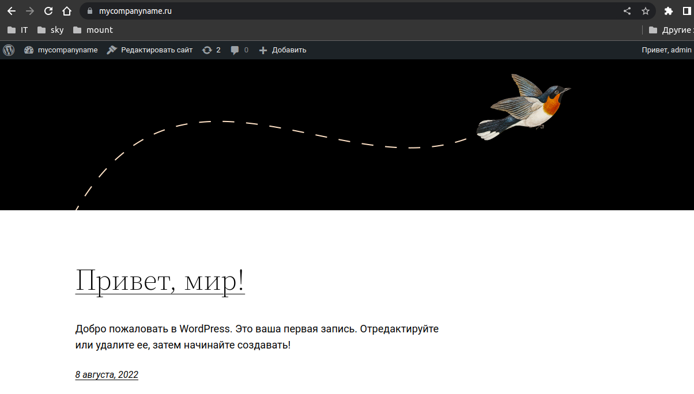

# Дипломный практикум в YandexCloud
  * [Цели:](#цели)
  * [Этапы выполнения:](#этапы-выполнения)
      * [Регистрация доменного имени](#регистрация-доменного-имени)
      * [Создание инфраструктуры](#создание-инфраструктуры)
          * [Установка Nginx и LetsEncrypt](#установка-nginx)
          * [Установка кластера MySQL](#установка-mysql)
          * [Установка WordPress](#установка-wordpress)
          * [Установка Gitlab CE, Gitlab Runner и настройка CI/CD](#установка-gitlab)
          * [Установка Prometheus, Alert Manager, Node Exporter и Grafana](#установка-prometheus)
  * [Что необходимо для сдачи задания?](#что-необходимо-для-сдачи-задания)
  * [Как правильно задавать вопросы дипломному руководителю?](#как-правильно-задавать-вопросы-дипломному-руководителю)

---
## Цели:

1. Зарегистрировать доменное имя (любое на ваш выбор в любой доменной зоне).
2. Подготовить инфраструктуру с помощью Terraform на базе облачного провайдера YandexCloud.
3. Настроить внешний Reverse Proxy на основе Nginx и LetsEncrypt.
4. Настроить кластер MySQL.
5. Установить WordPress.
6. Развернуть Gitlab CE и Gitlab Runner.
7. Настроить CI/CD для автоматического развёртывания приложения.
8. Настроить мониторинг инфраструктуры с помощью стека: Prometheus, Alert Manager и Grafana.

---
## Этапы выполнения:

### Регистрация доменного имени

Подойдет любое доменное имя на ваш выбор в любой доменной зоне.

ПРИМЕЧАНИЕ: Далее в качестве примера используется домен `you.domain` замените его вашим доменом.

Рекомендуемые регистраторы:
  - [nic.ru](https://nic.ru)
  - [reg.ru](https://reg.ru)

Цель:

1. Получить возможность выписывать [TLS сертификаты](https://letsencrypt.org) для веб-сервера.

Ожидаемые результаты:

1. У вас есть доступ к личному кабинету на сайте регистратора.
2. Вы зарезистрировали домен и можете им управлять (редактировать dns записи в рамках этого домена).

### Создание инфраструктуры

Для начала необходимо подготовить инфраструктуру в YC при помощи [Terraform](https://www.terraform.io/).

Особенности выполнения:

- Бюджет купона ограничен, что следует иметь в виду при проектировании инфраструктуры и использовании ресурсов;
- Следует использовать последнюю стабильную версию [Terraform](https://www.terraform.io/).

Предварительная подготовка:

1. Создайте сервисный аккаунт, который будет в дальнейшем использоваться Terraform для работы с инфраструктурой с необходимыми и достаточными правами. Не стоит использовать права суперпользователя
2. Подготовьте [backend](https://www.terraform.io/docs/language/settings/backends/index.html) для Terraform:
   а. Рекомендуемый вариант: [Terraform Cloud](https://app.terraform.io/)  
   б. Альтернативный вариант: S3 bucket в созданном YC аккаунте.
3. Настройте [workspaces](https://www.terraform.io/docs/language/state/workspaces.html)
   а. Рекомендуемый вариант: создайте два workspace: *stage* и *prod*. В случае выбора этого варианта все последующие шаги должны учитывать факт существования нескольких workspace.  
   б. Альтернативный вариант: используйте один workspace, назвав его *stage*. Пожалуйста, не используйте workspace, создаваемый Terraform-ом по-умолчанию (*default*).
4. Создайте VPC с подсетями в разных зонах доступности.
5. Убедитесь, что теперь вы можете выполнить команды `terraform destroy` и `terraform apply` без дополнительных ручных действий.
6. В случае использования [Terraform Cloud](https://app.terraform.io/) в качестве [backend](https://www.terraform.io/docs/language/settings/backends/index.html) убедитесь, что применение изменений успешно проходит, используя web-интерфейс Terraform cloud.

Цель:

1. Повсеместно применять IaaC подход при организации (эксплуатации) инфраструктуры.
2. Иметь возможность быстро создавать (а также удалять) виртуальные машины и сети. С целью экономии денег на вашем аккаунте в YandexCloud.

Ожидаемые результаты:

1. Terraform сконфигурирован и создание инфраструктуры посредством Terraform возможно без дополнительных ручных действий.
2. Полученная конфигурация инфраструктуры является предварительной, поэтому в ходе дальнейшего выполнения задания возможны изменения.

---
### Установка Nginx и LetsEncrypt

Необходимо разработать Ansible роль для установки Nginx и LetsEncrypt.

**Для получения LetsEncrypt сертификатов во время тестов своего кода пользуйтесь [тестовыми сертификатами](https://letsencrypt.org/docs/staging-environment/), так как количество запросов к боевым серверам LetsEncrypt [лимитировано](https://letsencrypt.org/docs/rate-limits/).**

Рекомендации:
  - Имя сервера: `you.domain`
  - Характеристики: 2vCPU, 2 RAM, External address (Public) и Internal address.

Цель:

1. Создать reverse proxy с поддержкой TLS для обеспечения безопасного доступа к веб-сервисам по HTTPS.

Ожидаемые результаты:

1. В вашей доменной зоне настроены все A-записи на внешний адрес этого сервера:
    - `https://www.you.domain` (WordPress)
    - `https://gitlab.you.domain` (Gitlab)
    - `https://grafana.you.domain` (Grafana)
    - `https://prometheus.you.domain` (Prometheus)
    - `https://alertmanager.you.domain` (Alert Manager)
2. Настроены все upstream для выше указанных URL, куда они сейчас ведут на этом шаге не важно, позже вы их отредактируете и укажите верные значения.
3. В браузере можно открыть любой из этих URL и увидеть ответ сервера (502 Bad Gateway). На текущем этапе выполнение задания это нормально!

___
### Установка кластера MySQL

Необходимо разработать Ansible роль для установки кластера MySQL.

Рекомендации:
  - Имена серверов: `db01.you.domain` и `db02.you.domain`
  - Характеристики: 4vCPU, 4 RAM, Internal address.

Цель:

1. Получить отказоустойчивый кластер баз данных MySQL.

Ожидаемые результаты:

1. MySQL работает в режиме репликации Master/Slave.
2. В кластере автоматически создаётся база данных c именем `wordpress`.
3. В кластере автоматически создаётся пользователь `wordpress` с полными правами на базу `wordpress` и паролем `wordpress`.

**Вы должны понимать, что в рамках обучения это допустимые значения, но в боевой среде использование подобных значений не приемлимо! Считается хорошей практикой использовать логины и пароли повышенного уровня сложности. В которых будут содержаться буквы верхнего и нижнего регистров, цифры, а также специальные символы!**

___
### Установка WordPress

Необходимо разработать Ansible роль для установки WordPress.

Рекомендации:
  - Имя сервера: `app.you.domain`
  - Характеристики: 4vCPU, 4 RAM, Internal address.

Цель:

1. Установить [WordPress](https://wordpress.org/download/). Это система управления содержимым сайта ([CMS](https://ru.wikipedia.org/wiki/Система_управления_содержимым)) с открытым исходным кодом.


По данным W3techs, WordPress используют 64,7% всех веб-сайтов, которые сделаны на CMS. Это 41,1% всех существующих в мире сайтов. Эту платформу для своих блогов используют The New York Times и Forbes. Такую популярность WordPress получил за удобство интерфейса и большие возможности.

Ожидаемые результаты:

1. Виртуальная машина, на которой установлен WordPress и Nginx/Apache (на ваше усмотрение).
2. В вашей доменной зоне настроена A-запись на внешний адрес reverse proxy:
    - `https://www.you.domain` (WordPress)
3. На сервере `you.domain` отредактирован upstream для выше указанного URL и он смотрит на виртуальную машину на которой установлен WordPress.
4. В браузере можно открыть URL `https://www.you.domain` и увидеть главную страницу WordPress.
---
### Установка Gitlab CE и Gitlab Runner

Необходимо настроить CI/CD систему для автоматического развертывания приложения при изменении кода.

Рекомендации:
  - Имена серверов: `gitlab.you.domain` и `runner.you.domain`
  - Характеристики: 4vCPU, 4 RAM, Internal address.

Цель:
1. Построить pipeline доставки кода в среду эксплуатации, то есть настроить автоматический деплой на сервер `app.you.domain` при коммите в репозиторий с WordPress.

Подробнее о [Gitlab CI](https://about.gitlab.com/stages-devops-lifecycle/continuous-integration/)

Ожидаемый результат:

1. Интерфейс Gitlab доступен по https.
2. В вашей доменной зоне настроена A-запись на внешний адрес reverse proxy:
    - `https://gitlab.you.domain` (Gitlab)
3. На сервере `you.domain` отредактирован upstream для выше указанного URL и он смотрит на виртуальную машину на которой установлен Gitlab.
4. При любом коммите в репозиторий с WordPress и создании тега (например, v1.0.0) происходит деплой на виртуальную машину.

___
### Установка Prometheus, Alert Manager, Node Exporter и Grafana

Необходимо разработать Ansible роль для установки Prometheus, Alert Manager и Grafana.

Рекомендации:
  - Имя сервера: `monitoring.you.domain`
  - Характеристики: 4vCPU, 4 RAM, Internal address.

Цель:

1. Получение метрик со всей инфраструктуры.

Ожидаемые результаты:

1. Интерфейсы Prometheus, Alert Manager и Grafana доступны по https.
2. В вашей доменной зоне настроены A-записи на внешний адрес reverse proxy:
  - `https://grafana.you.domain` (Grafana)
  - `https://prometheus.you.domain` (Prometheus)
  - `https://alertmanager.you.domain` (Alert Manager)
3. На сервере `you.domain` отредактированы upstreams для выше указанных URL и они смотрят на виртуальную машину на которой установлены Prometheus, Alert Manager и Grafana.
4. На всех серверах установлен Node Exporter и его метрики доступны Prometheus.
5. У Alert Manager есть необходимый [набор правил](https://awesome-prometheus-alerts.grep.to/rules.html) для создания алертов.
6. В Grafana есть дашборд, отображающий метрики из Node Exporter по всем серверам.
7. В Grafana есть дашборд, отображающий метрики из MySQL (*).
8. В Grafana есть дашборд, отображающий метрики из WordPress (*).

*Примечание: дашборды со звёздочкой являются опциональными заданиями повышенной сложности их выполнение желательно, но не обязательно.*

---
## Что необходимо для сдачи задания?

1. Репозиторий со всеми Terraform манифестами и готовность продемонстрировать создание всех ресурсов с нуля.
2. Репозиторий со всеми Ansible ролями и готовность продемонстрировать установку всех сервисов с нуля.
3. Скриншоты веб-интерфейсов всех сервисов работающих по HTTPS на вашем доменном имени.
  - `https://www.you.domain` (WordPress)
  - `https://gitlab.you.domain` (Gitlab)
  - `https://grafana.you.domain` (Grafana)
  - `https://prometheus.you.domain` (Prometheus)
  - `https://alertmanager.you.domain` (Alert Manager)
4. Все репозитории рекомендуется хранить на одном из ресурсов ([github.com](https://github.com) или [gitlab.com](https://gitlab.com)).

---
## Как правильно задавать вопросы дипломному руководителю?

**Что поможет решить большинство частых проблем:**

    
1. Попробовать найти ответ сначала самостоятельно в интернете или в
  материалах курса и ДЗ и только после этого спрашивать у дипломного
  руководителя. Навык поиска ответов пригодится вам в профессиональной
  деятельности.
2. Если вопросов больше одного, то присылайте их в виде нумерованного
  списка. Так дипломному руководителю будет проще отвечать на каждый из
  них.
3. При необходимости прикрепите к вопросу скриншоты и стрелочкой
  покажите, где не получается.

**Что может стать источником проблем:**

1. Вопросы вида «Ничего не работает. Не запускается. Всё сломалось». Дипломный руководитель не сможет ответить на такой вопрос без дополнительных уточнений. Цените своё время и время других.
2. Откладывание выполнения курсового проекта на последний момент.
3. Ожидание моментального ответа на свой вопрос. Дипломные руководители работающие разработчики, которые занимаются, кроме преподавания, своими проектами. Их время ограничено, поэтому постарайтесь задавать правильные вопросы, чтобы получать быстрые ответы :)


### 1. Зарегистрировать доменное имя (любое на ваш выбор в любой доменной зоне).
Зарегистрировали доменное имя в https://www.reg.ru/


### 2. Создание инфраструктуры

Предварительная подготовка:

1. [Создайте сервисный аккаунт](https://cloud.yandex.ru/docs/iam/operations/sa/create), который будет в дальнейшем использоваться Terraform для работы с инфраструктурой с необходимыми и достаточными правами. Не стоит использовать права суперпользователя

Создаем сервис-аккаунт:
```bash
mike@make-lptp:~/PycharmProjects/devops-netology/devops-diplom-yandexcloud/src/terraform$ yc iam service-account create --name netology-diplom
id: aje
folder_id: b1g
created_at: "2022-07-10T23:25:39.773508008Z"
name: netology-diplom

```
Назначим роль editor
```bash
mike@make-lptp:~/PycharmProjects/devops-netology/devops-diplom-yandexcloud/src/terraform$ yc resource-manager folder add-access-binding b1g3**** --role editor --subject serviceAccount:aje****
done (1s)
```
Создадим статический ключ доступа
```bash
mike@make-lptp:~/PycharmProjects/devops-netology/devops-diplom-yandexcloud/src/terraform$ yc iam access-key create --service-account-name netology-diplom
access_key:
  id: aje****
  service_account_id: aje****
  created_at: "2022-07-10T23:32:28.323165040Z"
  key_id: YCA****
secret: YCM****
```

2. Подготовьте [backend](https://www.terraform.io/docs/language/settings/backends/index.html) для Terraform. Остановим выбор на альтернативном варианте:  [S3 bucket в созданном YC аккаунте](https://cloud.yandex.ru/docs/storage/operations/buckets/create).
Создали бакет в YC:


Конфигурация содержится в файле [provider.tf](./src/terraform/provider.tf):

```terraform
backend "s3" {
  endpoint = "storage.yandexcloud.net"
  bucket   = "netology-diplom-devops"
  region   = "ru-central1"
  key      = "stage/terraform-stage.tfstate"

  skip_region_validation      = true
  skip_credentials_validation = true
}
```

3. Настройте [workspaces](https://www.terraform.io/docs/language/state/workspaces.html)
   * Рекомендуемый вариант: создайте два workspace: *stage* и *prod*. В случае выбора этого варианта все последующие шаги должны учитывать факт существования нескольких workspace.  
   * Альтернативный вариант: используйте один workspace, назвав его *stage*. Пожалуйста, не используйте workspace, создаваемый Terraform-ом по-умолчанию (*default*).


Создаем workspaces `prod` и `stage`:

```bash 
mike@make-lptp:~/PycharmProjects/devops-netology/devops-diplom-yandexcloud/src/terraform$ terraform workspace new prod
Created and switched to workspace "prod"!

You're now on a new, empty workspace. Workspaces isolate their state,
so if you run "terraform plan" Terraform will not see any existing state
for this configuration.
mike@make-lptp:~/PycharmProjects/devops-netology/devops-diplom-yandexcloud/src/terraform$ terraform workspace new stage
Created and switched to workspace "stage"!

You're now on a new, empty workspace. Workspaces isolate their state,
so if you run "terraform plan" Terraform will not see any existing state
for this configuration.
```

Проверяем наличие созданных workspace. Присутствуют:
```bash
mike@make-lptp:~/PycharmProjects/devops-netology/devops-diplom-yandexcloud/src/terraform$ terraform workspace list
  default
  prod
* stage
```

4. Создайте VPC с подсетями в разных зонах доступности.
Подготовили tf. файлы: 
* `node01.tf`
```terraform
resource "yandex_compute_instance" "test-server" {
  name = "testserver"
  platform_id = local.yc_instance_type_map[terraform.workspace]
  count = local.yc_instance_count[terraform.workspace]
  zone = local.vpc_zone[terraform.workspace]
  resources {
    cores  = local.yc_cores[terraform.workspace]
    memory = local.yc_mem[terraform.workspace]
      }
  boot_disk {
    initialize_params {
      image_id = "fd8f1tik9a7ap9ik2dg1"
      size = local.yc_disk_size[terraform.workspace]
    }
  }
  network_interface {
    subnet_id = yandex_vpc_subnet.yc_subnet.id
    /*yandex_vpc_network.yc_network.id*/
    nat       = true
  }
  metadata = {
    ssh-keys = "ubuntu:${file("~/.ssh/id_rsa.pub")}"
  }
}
```
* `locals.tf`
```terraform
locals {
  yc_instance_type_map = {
    stage = "standard-v1"
    prod  = "standard-v2"
  }
  yc_cores = {
    stage = 2
    prod  = 4
  }
  yc_disk_size = {
    stage = 10
    prod  = 20
  }
  yc_instance_count = {
    stage = 1
    prod  = 1
  }
  yc_mem = {
    stage = 4
    prod  = 8
  }
  vpc_zone = {
    stage = "ru-central1-a"
    prod  = "ru-central1-b"
  }
  vpc_subnets_v4-cidr = {
    stage = ["10.128.0.0/24"]
    prod  = ["10.128.0.0/24", "10.129.0.0/24"]
  }
}
```
* `network.tf`
```terraform
resource "yandex_vpc_network" "yc_network" {
  name = "vpc-network-${terraform.workspace}"
  }
resource "yandex_vpc_subnet" "yc_subnet" {
  name           = "yc_subnet"
  zone           = local.vpc_zone[terraform.workspace]
  network_id     = yandex_vpc_network.yc_network.id
  v4_cidr_blocks = local.vpc_subnets_v4-cidr[terraform.workspace]
}
```

5. Убедитесь, что теперь вы можете выполнить команды `terraform destroy` и `terraform apply` без дополнительных ручных действий.
Все работает за рядом исключений. Чтобы не светить ключи, необходимо экспортировать переменные перед инициализацией терраформ:

```bash 
 export AWS_ACCESS_KEY_ID=Ключ доступа
 export AWS_SECRET_ACCESS_KEY=Секретный ключ
```
Все ВМ успешно создаются, роли ansible успешно отрабатывают:

```bash
PLAY RECAP *********************************************************************
192.168.1.13               : ok=22   changed=17   unreachable=0    failed=0    skipped=3    rescued=0    ignored=0   
192.168.1.14               : ok=36   changed=32   unreachable=0    failed=0    skipped=1    rescued=0    ignored=0   
192.168.1.15               : ok=25   changed=23   unreachable=0    failed=0    skipped=0    rescued=0    ignored=0   
192.168.1.16               : ok=42   changed=14   unreachable=0    failed=0    skipped=14   rescued=0    ignored=0   
192.168.1.17               : ok=42   changed=13   unreachable=0    failed=0    skipped=14   rescued=0    ignored=0   
192.168.1.18               : ok=89   changed=25   unreachable=0    failed=0    skipped=110  rescued=0    ignored=0   
mycompanyname.ru           : ok=27   changed=25   unreachable=0    failed=0    skipped=0    rescued=0    ignored=0 
```

6. В случае использования [Terraform Cloud](https://app.terraform.io/) в качестве [backend](https://www.terraform.io/docs/language/settings/backends/index.html) убедитесь, что применение изменений успешно проходит, используя web-интерфейс Terraform cloud.

Terraform cloud не использовали. Данный пункт нет необходимости проверять.

Цель:

1. Повсеместно применять IaaC подход при организации (эксплуатации) инфраструктуры.
2. Иметь возможность быстро создавать (а также удалять) виртуальные машины и сети. С целью экономии денег на вашем аккаунте в YandexCloud.

Ожидаемые результаты:

1. Terraform сконфигурирован и создание инфраструктуры посредством Terraform возможно без дополнительных ручных действий.
2. Полученная конфигурация инфраструктуры является предварительной, поэтому в ходе дальнейшего выполнения задания возможны изменения.

---
### Установка Nginx и LetsEncrypt

Необходимо разработать Ansible роль для установки Nginx и LetsEncrypt.

**Для получения LetsEncrypt сертификатов во время тестов своего кода пользуйтесь [тестовыми сертификатами](https://letsencrypt.org/docs/staging-environment/), так как количество запросов к боевым серверам LetsEncrypt [лимитировано](https://letsencrypt.org/docs/rate-limits/).**

Рекомендации:
  - Имя сервера: `mycompanyname.ru`
  - Характеристики: 2vCPU, 2 RAM, External address (Public) и Internal address.

Цель:

1. Создать reverse proxy с поддержкой TLS для обеспечения безопасного доступа к веб-сервисам по HTTPS.

Ожидаемые результаты:

1. В вашей доменной зоне настроены все A-записи на внешний адрес этого сервера:
    - `https://www.mycompanyname.ru` (WordPress)
    - `https://gitlab.mycompanyname.ru` (Gitlab)
    - `https://grafana.mycompanyname.ru` (Grafana)
    - `https://prometheus.mycompanyname.ru` (Prometheus)
    - `https://alertmanager.mycompanyname.ru` (Alert Manager)
2. Настроены все upstream для выше указанных URL, куда они сейчас ведут на этом шаге не важно, позже вы их отредактируете и укажите верные значения.
3. В браузере можно открыть любой из этих URL и увидеть ответ сервера (502 Bad Gateway). На текущем этапе выполнение задания это нормально!


Итак, шаг номер раз. [Резервирование статического IP-адреса по инструкции](https://cloud.yandex.ru/docs/vpc/operations/get-static-ip) 

Шаг 2. Добавление А-записей в DNS нашей доменной зоны:


Шаг номер следующий. Создание ВМ с nginx и letsencrypt. Воспользуемся предварительным конфигом ВМ из предыдущего пункта диплома (и переделаем его почти полностью:)),
[инструкцией по установке nginx и letsencrypt](https://gist.github.com/mattiaslundberg/ba214a35060d3c8603e9b1ec8627d349) для написания собственной роли по настройке nginx reverse-proxy.

Получили [файл tf для ВМ с nginx](./src/terraform/nginx.tf) и [ansible-роль для установки nginx и letsencrypt с генерацией сертфиикатов](./src/ansible/nginx-proxy)
Конфигурация сервисов создается Ansible из template-файлов:
* [Gitlab](./src/ansible/nginx-proxy/templates/nginx-gitlab.j2)
* [Grafana](./src/ansible/nginx-proxy/templates/nginx-grafana.j2)
* [AlertManager](./src/ansible/nginx-proxy/templates/nginx-alertmanager.j2)
* [Prometheus](./src/ansible/nginx-proxy/templates/nginx-prometheus.j2)
* [WordPress](./src/ansible/nginx-proxy/templates/nginx-mycompanyname.j2)

Сертификаты LE на данном шаге генерируются с ключём --test-cert. По завершении тестирования будет необходимо удалить этот ключ. Также апстримы сервисов пока не ведут на серверы. Позже это будет исправлено.  

В браузере открывается страница 504 (Ошибка тайм-аута):


<details><summary>Вывод Ansible</summary>

```
PLAY [nginx] *******************************************************************

TASK [Gathering Facts] *********************************************************
ok: [mycompanyname.ru]

TASK [nginx-proxy : Install nginx] *********************************************
changed: [mycompanyname.ru]

TASK [nginx-proxy : Create Iptables NAT chain] *********************************
changed: [mycompanyname.ru]

TASK [nginx-proxy : Enable IPv4 forwarding] ************************************
changed: [mycompanyname.ru]

TASK [nginx-proxy : Install IPtables-persistent] *******************************
changed: [mycompanyname.ru]

TASK [nginx-proxy : install letsencrypt] ***************************************
changed: [mycompanyname.ru]

TASK [nginx-proxy : create letsencrypt directory] ******************************
changed: [mycompanyname.ru]

TASK [nginx-proxy : Remove default nginx config] *******************************
changed: [mycompanyname.ru]

TASK [nginx-proxy : Install system nginx config] *******************************
changed: [mycompanyname.ru]

TASK [nginx-proxy : Install nginx site for letsencrypt requests] ***************
changed: [mycompanyname.ru]

TASK [nginx-proxy : Reload nginx to activate letsencrypt site] *****************
changed: [mycompanyname.ru]

TASK [nginx-proxy : Create letsencrypt certificate www.mycompanyname.ru] *******
changed: [mycompanyname.ru]

TASK [nginx-proxy : Generate dhparams] *****************************************
changed: [mycompanyname.ru]

TASK [nginx-proxy : Install nginx site for MYCOMPANYNAME] **********************
changed: [mycompanyname.ru]

TASK [nginx-proxy : Install nginx site for GITLAB] *****************************
changed: [mycompanyname.ru]

TASK [nginx-proxy : Install nginx site for GRAFANA] ****************************
changed: [mycompanyname.ru]

TASK [nginx-proxy : Install nginx site for PROMETHEUS] *************************
changed: [mycompanyname.ru]

TASK [nginx-proxy : Install nginx site for ALERTMANAGER] ***********************
changed: [mycompanyname.ru]

TASK [nginx-proxy : Reload nginx to activate specified site] *******************
changed: [mycompanyname.ru]

TASK [nginx-proxy : Add letsencrypt cronjob for cert renewal] ******************
changed: [mycompanyname.ru]

TASK [node-exporter : Create User nodeexporter] ********************************
changed: [mycompanyname.ru]

TASK [node-exporter : Create directories for node-exporter] ********************
changed: [mycompanyname.ru]

TASK [node-exporter : Download And Unzipped node-exporter] *********************
changed: [mycompanyname.ru]

TASK [node-exporter : Copy Bin Files From Unzipped to node-exporter] ***********
changed: [mycompanyname.ru]

TASK [node-exporter : Create File for node-exporter Systemd] *******************
changed: [mycompanyname.ru]

TASK [node-exporter : Systemctl node-exporter Start] ***************************
changed: [mycompanyname.ru]

RUNNING HANDLER [node-exporter : systemd reload] *******************************
ok: [mycompanyname.ru]

```
</details>


___ 
### Установка кластера MySQL

Необходимо разработать Ansible роль для установки кластера MySQL.

Рекомендации:
  - Имена серверов: `db01.mycompanyname.ru` и `db02.mycompanyname.ru`
  - Характеристики: 4vCPU, 4 RAM, Internal address.

Цель:

1. Получить отказоустойчивый кластер баз данных MySQL.

Ожидаемые результаты:

1. MySQL работает в режиме репликации Master/Slave.
2. В кластере автоматически создаётся база данных c именем `wordpress`.
3. В кластере автоматически создаётся пользователь `wordpress` с полными правами на базу `wordpress` и паролем `wordpress`.
 

Подготовили tf файлы конфигурации ВМ согласно рекомендаций:
* [mysql01.tf](./src/terraform/mysql01.tf)
* [mysql02.tf](./src/terraform/mysql02.tf)

Подготовили ansible роль [mysql](./src/ansible/mysql)
При подготовке ansible роли `mysql` использовали (готовую роль)[https://galaxy.ansible.com/geerlingguy/mysql], скорректировав переменные: добавили БД `wordpress` и пользователя `wordpress` с паролем `wordpress`   

Playbook успешно отрабатывает:


<details><summary>Вывод Ansible</summary>

```
PLAY [mysql] *******************************************************************

TASK [Gathering Facts] *********************************************************
ok: [192.168.1.16]
ok: [192.168.1.17]

TASK [mysql : include_tasks] ***************************************************
included: /home/mike/PycharmProjects/devops-netology/devops-diplom-yandexcloud/src/ansible/mysql/tasks/variables.yml for 192.168.1.16, 192.168.1.17

TASK [mysql : Include OS-specific variables.] **********************************
ok: [192.168.1.16] => (item=/home/mike/PycharmProjects/devops-netology/devops-diplom-yandexcloud/src/ansible/mysql/vars/Debian.yml)
ok: [192.168.1.17] => (item=/home/mike/PycharmProjects/devops-netology/devops-diplom-yandexcloud/src/ansible/mysql/vars/Debian.yml)

TASK [mysql : Define mysql_packages.] ******************************************
ok: [192.168.1.16]
ok: [192.168.1.17]

TASK [mysql : Define mysql_daemon.] ********************************************
ok: [192.168.1.17]
ok: [192.168.1.16]

TASK [mysql : Define mysql_slow_query_log_file.] *******************************
ok: [192.168.1.16]
ok: [192.168.1.17]

TASK [mysql : Define mysql_log_error.] *****************************************
ok: [192.168.1.16]
ok: [192.168.1.17]

TASK [mysql : Define mysql_syslog_tag.] ****************************************
ok: [192.168.1.16]
ok: [192.168.1.17]

TASK [mysql : Define mysql_pid_file.] ******************************************
ok: [192.168.1.16]
ok: [192.168.1.17]

TASK [mysql : Define mysql_config_file.] ***************************************
ok: [192.168.1.16]
ok: [192.168.1.17]

TASK [mysql : Define mysql_config_include_dir.] ********************************
ok: [192.168.1.16]
ok: [192.168.1.17]

TASK [mysql : Define mysql_socket.] ********************************************
ok: [192.168.1.16]
ok: [192.168.1.17]

TASK [mysql : Define mysql_supports_innodb_large_prefix.] **********************
ok: [192.168.1.16]
ok: [192.168.1.17]

TASK [mysql : include_tasks] ***************************************************
skipping: [192.168.1.16]
skipping: [192.168.1.17]

TASK [mysql : include_tasks] ***************************************************
included: /home/mike/PycharmProjects/devops-netology/devops-diplom-yandexcloud/src/ansible/mysql/tasks/setup-Debian.yml for 192.168.1.16, 192.168.1.17

TASK [mysql : Check if MySQL is already installed.] ****************************
ok: [192.168.1.16]
ok: [192.168.1.17]

TASK [mysql : Update apt cache if MySQL is not yet installed.] *****************
ok: [192.168.1.16]
ok: [192.168.1.17]

TASK [mysql : Ensure MySQL Python libraries are installed.] ********************
changed: [192.168.1.16]
changed: [192.168.1.17]

TASK [mysql : Ensure MySQL packages are installed.] ****************************
changed: [192.168.1.17]
changed: [192.168.1.16]

TASK [mysql : Ensure MySQL is stopped after initial install.] ******************
changed: [192.168.1.17]
changed: [192.168.1.16]

TASK [mysql : Delete innodb log files created by apt package after initial install.] ***
ok: [192.168.1.16] => (item=ib_logfile0)
ok: [192.168.1.17] => (item=ib_logfile0)
ok: [192.168.1.16] => (item=ib_logfile1)
ok: [192.168.1.17] => (item=ib_logfile1)

TASK [mysql : include_tasks] ***************************************************
skipping: [192.168.1.16]
skipping: [192.168.1.17]

TASK [mysql : Check if MySQL packages were installed.] *************************
ok: [192.168.1.16]
ok: [192.168.1.17]

TASK [mysql : include_tasks] ***************************************************
included: /home/mike/PycharmProjects/devops-netology/devops-diplom-yandexcloud/src/ansible/mysql/tasks/configure.yml for 192.168.1.16, 192.168.1.17

TASK [mysql : Get MySQL version.] **********************************************
ok: [192.168.1.17]
ok: [192.168.1.16]

TASK [mysql : Copy my.cnf global MySQL configuration.] *************************
changed: [192.168.1.16]
changed: [192.168.1.17]

TASK [mysql : Verify mysql include directory exists.] **************************
skipping: [192.168.1.16]
skipping: [192.168.1.17]

TASK [mysql : Copy my.cnf override files into include directory.] **************

TASK [mysql : Create slow query log file (if configured).] *********************
skipping: [192.168.1.16]
skipping: [192.168.1.17]

TASK [mysql : Create datadir if it does not exist] *****************************
changed: [192.168.1.16]
changed: [192.168.1.17]

TASK [mysql : Set ownership on slow query log file (if configured).] ***********
skipping: [192.168.1.16]
skipping: [192.168.1.17]

TASK [mysql : Create error log file (if configured).] **************************
skipping: [192.168.1.16]
skipping: [192.168.1.17]

TASK [mysql : Set ownership on error log file (if configured).] ****************
skipping: [192.168.1.16]
skipping: [192.168.1.17]

TASK [mysql : Ensure MySQL is started and enabled on boot.] ********************
changed: [192.168.1.17]
changed: [192.168.1.16]

TASK [mysql : include_tasks] ***************************************************
included: /home/mike/PycharmProjects/devops-netology/devops-diplom-yandexcloud/src/ansible/mysql/tasks/secure-installation.yml for 192.168.1.16, 192.168.1.17

TASK [mysql : Ensure default user is present.] *********************************
changed: [192.168.1.16]
changed: [192.168.1.17]

TASK [mysql : Copy user-my.cnf file with password credentials.] ****************
changed: [192.168.1.16]
changed: [192.168.1.17]

TASK [mysql : Disallow root login remotely] ************************************
ok: [192.168.1.16] => (item=DELETE FROM mysql.user WHERE User='root' AND Host NOT IN ('localhost', '127.0.0.1', '::1'))
ok: [192.168.1.17] => (item=DELETE FROM mysql.user WHERE User='root' AND Host NOT IN ('localhost', '127.0.0.1', '::1'))

TASK [mysql : Get list of hosts for the root user.] ****************************
ok: [192.168.1.16]
ok: [192.168.1.17]

TASK [mysql : Update MySQL root password for localhost root account (5.7.x).] ***
changed: [192.168.1.16] => (item=localhost)
changed: [192.168.1.17] => (item=localhost)

TASK [mysql : Update MySQL root password for localhost root account (< 5.7.x).] ***
skipping: [192.168.1.16] => (item=localhost) 
skipping: [192.168.1.17] => (item=localhost) 

TASK [mysql : Copy .my.cnf file with root password credentials.] ***************
changed: [192.168.1.16]
changed: [192.168.1.17]

TASK [mysql : Get list of hosts for the anonymous user.] ***********************
ok: [192.168.1.16]
ok: [192.168.1.17]

TASK [mysql : Remove anonymous MySQL users.] ***********************************

TASK [mysql : Remove MySQL test database.] *************************************
ok: [192.168.1.16]
ok: [192.168.1.17]

TASK [mysql : include_tasks] ***************************************************
included: /home/mike/PycharmProjects/devops-netology/devops-diplom-yandexcloud/src/ansible/mysql/tasks/databases.yml for 192.168.1.16, 192.168.1.17

TASK [mysql : Ensure MySQL databases are present.] *****************************
changed: [192.168.1.16] => (item={'name': 'wordpress', 'collation': 'utf8_general_ci', 'encoding': 'utf8', 'replicate': 1})
changed: [192.168.1.17] => (item={'name': 'wordpress', 'collation': 'utf8_general_ci', 'encoding': 'utf8', 'replicate': 1})

TASK [mysql : include_tasks] ***************************************************
included: /home/mike/PycharmProjects/devops-netology/devops-diplom-yandexcloud/src/ansible/mysql/tasks/users.yml for 192.168.1.16, 192.168.1.17

TASK [mysql : Ensure MySQL users are present.] *********************************
changed: [192.168.1.16] => (item=None)
changed: [192.168.1.17] => (item=None)
changed: [192.168.1.16] => (item=None)
changed: [192.168.1.16]
changed: [192.168.1.17] => (item=None)
changed: [192.168.1.17]

TASK [mysql : include_tasks] ***************************************************
included: /home/mike/PycharmProjects/devops-netology/devops-diplom-yandexcloud/src/ansible/mysql/tasks/replication.yml for 192.168.1.16, 192.168.1.17

TASK [mysql : Ensure replication user exists on master.] ***********************
skipping: [192.168.1.17]
changed: [192.168.1.16]

TASK [mysql : Check slave replication status.] *********************************
skipping: [192.168.1.16]
ok: [192.168.1.17]

TASK [mysql : Check master replication status.] ********************************
skipping: [192.168.1.16]
skipping: [192.168.1.17]

TASK [mysql : Configure replication on the slave.] *****************************
skipping: [192.168.1.16]
skipping: [192.168.1.17]

TASK [mysql : Start replication.] **********************************************
skipping: [192.168.1.16]
skipping: [192.168.1.17]

RUNNING HANDLER [mysql : restart mysql] ****************************************
changed: [192.168.1.16]
changed: [192.168.1.17]
```
</details>


___
### Установка WordPress

Необходимо разработать Ansible роль для установки WordPress.

Данные:
  - Имя сервера: `app.mycompanyname.ru`
  - Характеристики: 4vCPU, 4 RAM, Internal address.

Цель:

1. Установить [WordPress](https://wordpress.org/download/).

Ожидаемые результаты:

1. Виртуальная машина, на которой установлен WordPress и Nginx/Apache (на ваше усмотрение).
2. В вашей доменной зоне настроена A-запись на внешний адрес reverse proxy:
    - `https://www.mycompanyname.ru` (WordPress)
3. На сервере `mycompanyname.ru` отредактирован upstream для выше указанного URL и он смотрит на виртуальную машину на которой установлен WordPress.
4. В браузере можно открыть URL `https://www.mycompanyname.ru` и увидеть главную страницу WordPress.


Результаты:
1. [tf-файл ВМ с WordPress](./src/terraform/wordpress.tf)
2. Настроена A-запись в доменной зоне mycompanyname.ru:

3. На сервере `mycompanyname.ru` отредактирован upstream для WordPress. [ссылка](./src/ansible/nginx-proxy/templates/nginx-mycompanyname.j2) на шаблон конфигурационного файла
4. Главная страница WordPress:

---

<details><summary>Вывод Ansible</summary>

```
PLAY [wordpress] ***************************************************************

TASK [Gathering Facts] *********************************************************
ok: [192.168.1.15]

TASK [wordpress : Update apt cache] ********************************************
changed: [192.168.1.15]

TASK [wordpress : Install prerequisites] ***************************************
changed: [192.168.1.15]

TASK [wordpress : Install LAMP Packages] ***************************************
changed: [192.168.1.15] => (item=apache2)
changed: [192.168.1.15] => (item=php)
changed: [192.168.1.15] => (item=php-mysql)
changed: [192.168.1.15] => (item=libapache2-mod-php)

TASK [wordpress : Install PHP Extensions] **************************************
changed: [192.168.1.15] => (item=php-curl)
changed: [192.168.1.15] => (item=php-gd)
changed: [192.168.1.15] => (item=php-mbstring)
changed: [192.168.1.15] => (item=php-xml)
changed: [192.168.1.15] => (item=php-xmlrpc)
changed: [192.168.1.15] => (item=php-soap)
changed: [192.168.1.15] => (item=php-intl)
changed: [192.168.1.15] => (item=php-zip)

TASK [wordpress : Create document root] ****************************************
changed: [192.168.1.15]

TASK [wordpress : Set up Apache VirtualHost] ***********************************
changed: [192.168.1.15]

TASK [wordpress : Enable rewrite module] ***************************************
changed: [192.168.1.15]

TASK [wordpress : Enable new site] *********************************************
changed: [192.168.1.15]

TASK [wordpress : Disable default Apache site] *********************************
changed: [192.168.1.15]

TASK [wordpress : UFW - Allow HTTP on port 80] *********************************
changed: [192.168.1.15]

TASK [wordpress : Download and unpack latest WordPress] ************************
changed: [192.168.1.15]

TASK [wordpress : Set ownership] ***********************************************
changed: [192.168.1.15]

TASK [wordpress : Set permissions for directories] *****************************
changed: [192.168.1.15]

TASK [wordpress : Set permissions for files] ***********************************
changed: [192.168.1.15]

TASK [wordpress : Set up wp-config] ********************************************
changed: [192.168.1.15]

TASK [node-exporter : Create User nodeexporter] ********************************
changed: [192.168.1.15]

TASK [node-exporter : Create directories for node-exporter] ********************
changed: [192.168.1.15]

TASK [node-exporter : Download And Unzipped node-exporter] *********************
changed: [192.168.1.15]

TASK [node-exporter : Copy Bin Files From Unzipped to node-exporter] ***********
changed: [192.168.1.15]

TASK [node-exporter : Create File for node-exporter Systemd] *******************
changed: [192.168.1.15]

TASK [node-exporter : Systemctl node-exporter Start] ***************************
changed: [192.168.1.15]

RUNNING HANDLER [wordpress : reload apache] ************************************
changed: [192.168.1.15]

RUNNING HANDLER [wordpress : restart apache] ***********************************
changed: [192.168.1.15]

RUNNING HANDLER [node-exporter : systemd reload] *******************************
ok: [192.168.1.15]
```
</details>


### Установка Gitlab CE и Gitlab Runner

Необходимо настроить CI/CD систему для автоматического развертывания приложения при изменении кода.
По результатам работ коллег было решено увеличить размер оперативной памяти ВМ. Будем использовать 8 Гб против 4Гб для повыешния производительности сервера при установке и настройке.
Данные:
  - Имена серверов: `gitlab.mycompanyname.ru` и `runner.mycompanyname.ru`
  - Характеристики: 4vCPU, 8 RAM, Internal address.

Цель:
1. Построить pipeline доставки кода в среду эксплуатации, то есть настроить автоматический деплой на сервер `app.you.domain` при коммите в репозиторий с WordPress.

Подробнее о [Gitlab CI](https://about.gitlab.com/stages-devops-lifecycle/continuous-integration/)

Ожидаемый результат:

1. Интерфейс Gitlab доступен по https.
2. В вашей доменной зоне настроена A-запись на внешний адрес reverse proxy:
    - `https://gitlab.you.domain` (Gitlab)
3. На сервере `you.domain` отредактирован upstream для выше указанного URL и он смотрит на виртуальную машину на которой установлен Gitlab.
4. При любом коммите в репозиторий с WordPress и создании тега (например, v1.0.0) происходит деплой на виртуальную машину.

Для установки gitlab будем использовать готовую [ansible-роль](https://github.com/geerlingguy/ansible-role-gitlab) за основу
Для установки gitlab-runner будем использовать готовую [ansible-роль](https://github.com/riemers/ansible-gitlab-runner) за основу


<details><summary>Вывод Ansible</summary>

```
PLAY [gitlab] ******************************************************************

TASK [Gathering Facts] *********************************************************
ok: [192.168.1.13]

TASK [gitlab : Update apt cache.] **********************************************
changed: [192.168.1.13]

TASK [gitlab : Include OS-specific variables.] *********************************
ok: [192.168.1.13]

TASK [gitlab : Check if GitLab configuration file already exists.] *************
ok: [192.168.1.13]

TASK [gitlab : Check if GitLab is already installed.] **************************
ok: [192.168.1.13]

TASK [gitlab : Install GitLab dependencies.] ***********************************
changed: [192.168.1.13]

TASK [gitlab : Install GitLab dependencies (Debian).] **************************
changed: [192.168.1.13]

TASK [gitlab : Download GitLab repository installation script.] ****************
changed: [192.168.1.13]

TASK [gitlab : Install GitLab repository.] *************************************
changed: [192.168.1.13]

TASK [gitlab : Define the Gitlab package name.] ********************************
skipping: [192.168.1.13]

TASK [gitlab : Install GitLab] *************************************************
ASYNC POLL on 192.168.1.13: jid=548835480181.3919 started=1 finished=0
ASYNC POLL on 192.168.1.13: jid=548835480181.3919 started=1 finished=0
ASYNC POLL on 192.168.1.13: jid=548835480181.3919 started=1 finished=0
ASYNC POLL on 192.168.1.13: jid=548835480181.3919 started=1 finished=0
ASYNC POLL on 192.168.1.13: jid=548835480181.3919 started=1 finished=0
ASYNC POLL on 192.168.1.13: jid=548835480181.3919 started=1 finished=0
ASYNC POLL on 192.168.1.13: jid=548835480181.3919 started=1 finished=0
ASYNC POLL on 192.168.1.13: jid=548835480181.3919 started=1 finished=0
ASYNC POLL on 192.168.1.13: jid=548835480181.3919 started=1 finished=0
ASYNC POLL on 192.168.1.13: jid=548835480181.3919 started=1 finished=0
ASYNC POLL on 192.168.1.13: jid=548835480181.3919 started=1 finished=0
ASYNC POLL on 192.168.1.13: jid=548835480181.3919 started=1 finished=0
ASYNC POLL on 192.168.1.13: jid=548835480181.3919 started=1 finished=0
ASYNC POLL on 192.168.1.13: jid=548835480181.3919 started=1 finished=0
ASYNC POLL on 192.168.1.13: jid=548835480181.3919 started=1 finished=0
ASYNC POLL on 192.168.1.13: jid=548835480181.3919 started=1 finished=0
ASYNC POLL on 192.168.1.13: jid=548835480181.3919 started=1 finished=0
ASYNC POLL on 192.168.1.13: jid=548835480181.3919 started=1 finished=0
ASYNC POLL on 192.168.1.13: jid=548835480181.3919 started=1 finished=0
ASYNC POLL on 192.168.1.13: jid=548835480181.3919 started=1 finished=0
ASYNC POLL on 192.168.1.13: jid=548835480181.3919 started=1 finished=0
ASYNC OK on 192.168.1.13: jid=548835480181.3919
changed: [192.168.1.13]

TASK [gitlab : install runner token] *******************************************
changed: [192.168.1.13]

TASK [gitlab : install root password] ******************************************
changed: [192.168.1.13]

TASK [gitlab : Reconfigure GitLab (first run).] ********************************
changed: [192.168.1.13]

TASK [gitlab : Create GitLab SSL configuration folder.] ************************
skipping: [192.168.1.13]

TASK [gitlab : Create self-signed certificate.] ********************************
skipping: [192.168.1.13]

TASK [gitlab : Copy GitLab configuration file.] ********************************
changed: [192.168.1.13]

TASK [node-exporter : Create User nodeexporter] ********************************
changed: [192.168.1.13]

TASK [node-exporter : Create directories for node-exporter] ********************
changed: [192.168.1.13]

TASK [node-exporter : Download And Unzipped node-exporter] *********************
changed: [192.168.1.13]

TASK [node-exporter : Copy Bin Files From Unzipped to node-exporter] ***********
changed: [192.168.1.13]

TASK [node-exporter : Create File for node-exporter Systemd] *******************
changed: [192.168.1.13]

TASK [node-exporter : Systemctl node-exporter Start] ***************************
changed: [192.168.1.13]

RUNNING HANDLER [gitlab : restart gitlab] **************************************
changed: [192.168.1.13]

RUNNING HANDLER [node-exporter : systemd reload] *******************************
ok: [192.168.1.13]

PLAY [runner] ******************************************************************

TASK [Gathering Facts] *********************************************************
ok: [192.168.1.18]

TASK [gitlab-runner : Load platform-specific variables] ************************
ok: [192.168.1.18]

TASK [gitlab-runner : (Container) Pull Image from Registry] ********************
skipping: [192.168.1.18]

TASK [gitlab-runner : (Container) Define Container volume Path] ****************
skipping: [192.168.1.18]

TASK [gitlab-runner : (Container) List configured runners] *********************
skipping: [192.168.1.18]

TASK [gitlab-runner : (Container) Check runner is registered] ******************
skipping: [192.168.1.18]

TASK [gitlab-runner : configured_runners?] *************************************
skipping: [192.168.1.18]

TASK [gitlab-runner : verified_runners?] ***************************************
skipping: [192.168.1.18]

TASK [gitlab-runner : (Container) Register GitLab Runner] **********************
skipping: [192.168.1.18] => (item={'name': 'runner', 'state': 'present', 'executor': 'shell', 'output_limit': 4096, 'concurrent_specific': '0', 'docker_image': '', 'tags': [], 'run_untagged': True, 'protected': False, 'docker_privileged': False, 'locked': 'false', 'docker_network_mode': 'bridge', 'env_vars': []}) 

TASK [gitlab-runner : Create .gitlab-runner dir] *******************************
skipping: [192.168.1.18]

TASK [gitlab-runner : Ensure config.toml exists] *******************************
skipping: [192.168.1.18]

TASK [gitlab-runner : Set concurrent option] ***********************************
skipping: [192.168.1.18]

TASK [gitlab-runner : Add listen_address to config] ****************************
skipping: [192.168.1.18]

TASK [gitlab-runner : Add log_format to config] ********************************
skipping: [192.168.1.18]

TASK [gitlab-runner : Add sentry dsn to config] ********************************
skipping: [192.168.1.18]

TASK [gitlab-runner : Add session server listen_address to config] *************
skipping: [192.168.1.18]

TASK [gitlab-runner : Add session server advertise_address to config] **********
skipping: [192.168.1.18]

TASK [gitlab-runner : Add session server session_timeout to config] ************
skipping: [192.168.1.18]

TASK [gitlab-runner : Get existing config.toml] ********************************
skipping: [192.168.1.18]

TASK [gitlab-runner : Get pre-existing runner configs] *************************
skipping: [192.168.1.18]

TASK [gitlab-runner : Create temporary directory] ******************************
skipping: [192.168.1.18]

TASK [gitlab-runner : Write config section for each runner] ********************
skipping: [192.168.1.18]

TASK [gitlab-runner : Assemble new config.toml] ********************************
skipping: [192.168.1.18]

TASK [gitlab-runner : (Container) Start the container] *************************
skipping: [192.168.1.18]

TASK [gitlab-runner : (Debian) Get Gitlab repository installation script] ******
changed: [192.168.1.18]

TASK [gitlab-runner : (Debian) Install Gitlab repository] **********************
changed: [192.168.1.18]

TASK [gitlab-runner : (Debian) Update gitlab_runner_package_name] **************
skipping: [192.168.1.18]

TASK [gitlab-runner : (Debian) Set gitlab_runner_package_name] *****************
ok: [192.168.1.18]

TASK [gitlab-runner : (Debian) Install GitLab Runner] **************************
changed: [192.168.1.18]

TASK [gitlab-runner : (Debian) Install GitLab Runner] **************************
skipping: [192.168.1.18]

TASK [gitlab-runner : (Debian) Remove ~/gitlab-runner/.bash_logout on debian buster and ubuntu focal] ***
ok: [192.168.1.18]

TASK [gitlab-runner : Ensure /etc/systemd/system/gitlab-runner.service.d/ exists] ***
changed: [192.168.1.18]

TASK [gitlab-runner : Add reload command to GitLab Runner system service] ******
changed: [192.168.1.18]

TASK [gitlab-runner : Configure graceful stop for GitLab Runner system service] ***
changed: [192.168.1.18]

TASK [gitlab-runner : Force systemd to reread configs] *************************
ok: [192.168.1.18]

TASK [gitlab-runner : (RedHat) Get Gitlab repository installation script] ******
skipping: [192.168.1.18]

TASK [gitlab-runner : (RedHat) Install Gitlab repository] **********************
skipping: [192.168.1.18]

TASK [gitlab-runner : (RedHat) Update gitlab_runner_package_name] **************
skipping: [192.168.1.18]

TASK [gitlab-runner : (RedHat) Set gitlab_runner_package_name] *****************
skipping: [192.168.1.18]

TASK [gitlab-runner : (RedHat) Install GitLab Runner] **************************
skipping: [192.168.1.18]

TASK [gitlab-runner : Ensure /etc/systemd/system/gitlab-runner.service.d/ exists] ***
skipping: [192.168.1.18]

TASK [gitlab-runner : Add reload command to GitLab Runner system service] ******
skipping: [192.168.1.18]

TASK [gitlab-runner : Configure graceful stop for GitLab Runner system service] ***
skipping: [192.168.1.18]

TASK [gitlab-runner : Force systemd to reread configs] *************************
skipping: [192.168.1.18]

TASK [gitlab-runner : (MacOS) Check gitlab-runner executable exists] ***********
skipping: [192.168.1.18]

TASK [gitlab-runner : (MacOS) Set fact -> gitlab_runner_exists] ****************
skipping: [192.168.1.18]

TASK [gitlab-runner : (MacOS) Get existing version] ****************************
skipping: [192.168.1.18]

TASK [gitlab-runner : (MacOS) Set fact -> gitlab_runner_existing_version] ******
skipping: [192.168.1.18]

TASK [gitlab-runner : (MacOS) Precreate gitlab-runner log directory] ***********
skipping: [192.168.1.18]

TASK [gitlab-runner : (MacOS) Download GitLab Runner] **************************
skipping: [192.168.1.18]

TASK [gitlab-runner : (MacOS) Setting Permissions for gitlab-runner executable] ***
skipping: [192.168.1.18]

TASK [gitlab-runner : (MacOS) Install GitLab Runner] ***************************
skipping: [192.168.1.18]

TASK [gitlab-runner : (MacOS) Start GitLab Runner] *****************************
skipping: [192.168.1.18]

TASK [gitlab-runner : (MacOS) Stop GitLab Runner] ******************************
skipping: [192.168.1.18]

TASK [gitlab-runner : (MacOS) Download GitLab Runner] **************************
skipping: [192.168.1.18]

TASK [gitlab-runner : (MacOS) Setting Permissions for gitlab-runner executable] ***
skipping: [192.168.1.18]

TASK [gitlab-runner : (MacOS) Start GitLab Runner] *****************************
skipping: [192.168.1.18]

TASK [gitlab-runner : (Arch) Set gitlab_runner_package_name] *******************
skipping: [192.168.1.18]

TASK [gitlab-runner : (Arch) Install GitLab Runner] ****************************
skipping: [192.168.1.18]

TASK [gitlab-runner : Ensure /etc/systemd/system/gitlab-runner.service.d/ exists] ***
skipping: [192.168.1.18]

TASK [gitlab-runner : Add reload command to GitLab Runner system service] ******
skipping: [192.168.1.18]

TASK [gitlab-runner : Configure graceful stop for GitLab Runner system service] ***
skipping: [192.168.1.18]

TASK [gitlab-runner : Force systemd to reread configs] *************************
skipping: [192.168.1.18]

TASK [gitlab-runner : (Unix) List configured runners] **************************
ok: [192.168.1.18]

TASK [gitlab-runner : (Unix) Check runner is registered] ***********************
ok: [192.168.1.18]

TASK [gitlab-runner : (Unix) Register GitLab Runner] ***************************
included: /home/mike/PycharmProjects/devops-netology/devops-diplom-yandexcloud/src/ansible/gitlab-runner/tasks/register-runner.yml for 192.168.1.18 => (item={'name': 'runner', 'state': 'present', 'executor': 'shell', 'output_limit': 4096, 'concurrent_specific': '0', 'docker_image': '', 'tags': [], 'run_untagged': True, 'protected': False, 'docker_privileged': False, 'locked': 'false', 'docker_network_mode': 'bridge', 'env_vars': []})

TASK [gitlab-runner : remove config.toml file] *********************************
skipping: [192.168.1.18]

TASK [gitlab-runner : Create .gitlab-runner dir] *******************************
skipping: [192.168.1.18]

TASK [gitlab-runner : Ensure config.toml exists] *******************************
skipping: [192.168.1.18]

TASK [gitlab-runner : Construct the runner command without secrets] ************
ok: [192.168.1.18]

TASK [gitlab-runner : Register runner to GitLab] *******************************
changed: [192.168.1.18]

TASK [gitlab-runner : Create .gitlab-runner dir] *******************************
ok: [192.168.1.18]

TASK [gitlab-runner : Ensure config.toml exists] *******************************
ok: [192.168.1.18]

TASK [gitlab-runner : Set concurrent option] ***********************************
changed: [192.168.1.18]

TASK [gitlab-runner : Add listen_address to config] ****************************
skipping: [192.168.1.18]

TASK [gitlab-runner : Add log_format to config] ********************************
skipping: [192.168.1.18]

TASK [gitlab-runner : Add sentry dsn to config] ********************************
skipping: [192.168.1.18]

TASK [gitlab-runner : Add session server listen_address to config] *************
ok: [192.168.1.18]

TASK [gitlab-runner : Add session server advertise_address to config] **********
ok: [192.168.1.18]

TASK [gitlab-runner : Add session server session_timeout to config] ************
ok: [192.168.1.18]

TASK [gitlab-runner : Get existing config.toml] ********************************
ok: [192.168.1.18]

TASK [gitlab-runner : Get pre-existing runner configs] *************************
ok: [192.168.1.18]

TASK [gitlab-runner : Create temporary directory] ******************************
ok: [192.168.1.18]

TASK [gitlab-runner : Write config section for each runner] ********************
included: /home/mike/PycharmProjects/devops-netology/devops-diplom-yandexcloud/src/ansible/gitlab-runner/tasks/config-runner.yml for 192.168.1.18 => (item=concurrent = 4
check_interval = 0

[session_server]
  session_timeout = 1800

)
included: /home/mike/PycharmProjects/devops-netology/devops-diplom-yandexcloud/src/ansible/gitlab-runner/tasks/config-runner.yml for 192.168.1.18 => (item=  name = "runner"
  output_limit = 4096
  url = "http://gitlab.mycompanyname.ru"
  token = "Sa4Bq7EbUNTmKSstAqoh"
  executor = "shell"
  [runners.custom_build_dir]
  [runners.cache]
    [runners.cache.s3]
    [runners.cache.gcs]
    [runners.cache.azure]
)

TASK [gitlab-runner : conf[1/2]: Create temporary file] ************************
ok: [192.168.1.18]

TASK [gitlab-runner : conf[1/2]: Isolate runner configuration] *****************
ok: [192.168.1.18]

TASK [gitlab-runner : include_tasks] *******************************************
skipping: [192.168.1.18] => (item={'name': 'runner', 'state': 'present', 'executor': 'shell', 'output_limit': 4096, 'concurrent_specific': '0', 'docker_image': '', 'tags': [], 'run_untagged': True, 'protected': False, 'docker_privileged': False, 'locked': 'false', 'docker_network_mode': 'bridge', 'env_vars': []}) 

TASK [gitlab-runner : conf[1/2]: Remove runner config] *************************
skipping: [192.168.1.18] => (item={'name': 'runner', 'state': 'present', 'executor': 'shell', 'output_limit': 4096, 'concurrent_specific': '0', 'docker_image': '', 'tags': [], 'run_untagged': True, 'protected': False, 'docker_privileged': False, 'locked': 'false', 'docker_network_mode': 'bridge', 'env_vars': []}) 

TASK [gitlab-runner : conf[2/2]: Create temporary file] ************************
ok: [192.168.1.18]

TASK [gitlab-runner : conf[2/2]: Isolate runner configuration] *****************
ok: [192.168.1.18]

TASK [gitlab-runner : include_tasks] *******************************************
included: /home/mike/PycharmProjects/devops-netology/devops-diplom-yandexcloud/src/ansible/gitlab-runner/tasks/update-config-runner.yml for 192.168.1.18 => (item={'name': 'runner', 'state': 'present', 'executor': 'shell', 'output_limit': 4096, 'concurrent_specific': '0', 'docker_image': '', 'tags': [], 'run_untagged': True, 'protected': False, 'docker_privileged': False, 'locked': 'false', 'docker_network_mode': 'bridge', 'env_vars': []})

TASK [gitlab-runner : conf[2/2]: runner[1/1]: Set concurrent limit option] *****
changed: [192.168.1.18]

TASK [gitlab-runner : conf[2/2]: runner[1/1]: Set coordinator URL] *************
ok: [192.168.1.18]

TASK [gitlab-runner : conf[2/2]: runner[1/1]: Set clone URL] *******************
skipping: [192.168.1.18]

TASK [gitlab-runner : conf[2/2]: runner[1/1]: Set environment option] **********
changed: [192.168.1.18]

TASK [gitlab-runner : conf[2/2]: runner[1/1]: Set pre_clone_script] ************
skipping: [192.168.1.18]

TASK [gitlab-runner : conf[2/2]: runner[1/1]: Set pre_build_script] ************
skipping: [192.168.1.18]

TASK [gitlab-runner : conf[2/2]: runner[1/1]: Set tls_ca_file] *****************
skipping: [192.168.1.18]

TASK [gitlab-runner : conf[2/2]: runner[1/1]: Set post_build_script] ***********
skipping: [192.168.1.18]

TASK [gitlab-runner : conf[2/2]: runner[1/1]: Set runner executor option] ******
ok: [192.168.1.18]

TASK [gitlab-runner : conf[2/2]: runner[1/1]: Set runner shell option] *********
ok: [192.168.1.18]

TASK [gitlab-runner : conf[2/2]: runner[1/1]: Set runner executor section] *****
ok: [192.168.1.18]

TASK [gitlab-runner : conf[2/2]: runner[1/1]: Set output_limit option] *********
ok: [192.168.1.18]

TASK [gitlab-runner : conf[2/2]: runner[1/1]: Set runner docker image option] ***
changed: [192.168.1.18]

TASK [gitlab-runner : conf[2/2]: runner[1/1]: Set docker helper image option] ***
ok: [192.168.1.18]

TASK [gitlab-runner : conf[2/2]: runner[1/1]: Set docker privileged option] ****
changed: [192.168.1.18]

TASK [gitlab-runner : conf[2/2]: runner[1/1]: Set docker wait_for_services_timeout option] ***
ok: [192.168.1.18]

TASK [gitlab-runner : conf[2/2]: runner[1/1]: Set docker tlsverify option] *****
ok: [192.168.1.18]

TASK [gitlab-runner : conf[2/2]: runner[1/1]: Set docker shm_size option] ******
ok: [192.168.1.18]

TASK [gitlab-runner : conf[2/2]: runner[1/1]: Set docker disable_cache option] ***
ok: [192.168.1.18]

TASK [gitlab-runner : conf[2/2]: runner[1/1]: Set docker DNS option] ***********
ok: [192.168.1.18]

TASK [gitlab-runner : conf[2/2]: runner[1/1]: Set docker DNS search option] ****
ok: [192.168.1.18]

TASK [gitlab-runner : conf[2/2]: runner[1/1]: Set docker pull_policy option] ***
ok: [192.168.1.18]

TASK [gitlab-runner : conf[2/2]: runner[1/1]: Set docker volumes option] *******
ok: [192.168.1.18]

TASK [gitlab-runner : conf[2/2]: runner[1/1]: Set docker devices option] *******
ok: [192.168.1.18]

TASK [gitlab-runner : conf[2/2]: runner[1/1]: Set runner docker network option] ***
changed: [192.168.1.18]

TASK [gitlab-runner : conf[2/2]: runner[1/1]: Set custom_build_dir section] ****
changed: [192.168.1.18]

TASK [gitlab-runner : conf[2/2]: runner[1/1]: Set docker custom_build_dir-enabled option] ***
ok: [192.168.1.18]

TASK [gitlab-runner : conf[2/2]: runner[1/1]: Set cache section] ***************
ok: [192.168.1.18]

TASK [gitlab-runner : conf[2/2]: runner[1/1]: Set cache s3 section] ************
changed: [192.168.1.18]

TASK [gitlab-runner : conf[2/2]: runner[1/1]: Set cache gcs section] ***********
changed: [192.168.1.18]

TASK [gitlab-runner : conf[2/2]: runner[1/1]: Set cache azure section] *********
changed: [192.168.1.18]

TASK [gitlab-runner : conf[2/2]: runner[1/1]: Set cache type option] ***********
ok: [192.168.1.18]

TASK [gitlab-runner : conf[2/2]: runner[1/1]: Set cache path option] ***********
ok: [192.168.1.18]

TASK [gitlab-runner : conf[2/2]: runner[1/1]: Set cache shared option] *********
ok: [192.168.1.18]

TASK [gitlab-runner : conf[2/2]: runner[1/1]: Set cache s3 server addresss] ****
ok: [192.168.1.18]

TASK [gitlab-runner : conf[2/2]: runner[1/1]: Set cache s3 access key] *********
ok: [192.168.1.18]

TASK [gitlab-runner : conf[2/2]: runner[1/1]: Set cache s3 secret key] *********
ok: [192.168.1.18]

TASK [gitlab-runner : conf[2/2]: runner[1/1]: Set cache s3 bucket name option] ***
skipping: [192.168.1.18]

TASK [gitlab-runner : conf[2/2]: runner[1/1]: Set cache s3 bucket location option] ***
ok: [192.168.1.18]

TASK [gitlab-runner : conf[2/2]: runner[1/1]: Set cache s3 insecure option] ****
ok: [192.168.1.18]

TASK [gitlab-runner : conf[2/2]: runner[1/1]: Set cache gcs bucket name] *******
skipping: [192.168.1.18]

TASK [gitlab-runner : conf[2/2]: runner[1/1]: Set cache gcs credentials file] ***
ok: [192.168.1.18]

TASK [gitlab-runner : conf[2/2]: runner[1/1]: Set cache gcs access id] *********
ok: [192.168.1.18]

TASK [gitlab-runner : conf[2/2]: runner[1/1]: Set cache gcs private key] *******
ok: [192.168.1.18]

TASK [gitlab-runner : conf[2/2]: runner[1/1]: Set cache azure account name] ****
ok: [192.168.1.18]

TASK [gitlab-runner : conf[2/2]: runner[1/1]: Set cache azure account key] *****
ok: [192.168.1.18]

TASK [gitlab-runner : conf[2/2]: runner[1/1]: Set cache azure container name] ***
ok: [192.168.1.18]

TASK [gitlab-runner : conf[2/2]: runner[1/1]: Set cache azure storage domain] ***
ok: [192.168.1.18]

TASK [gitlab-runner : conf[2/2]: runner[1/1]: Set ssh user option] *************
ok: [192.168.1.18]

TASK [gitlab-runner : conf[2/2]: runner[1/1]: Set ssh host option] *************
ok: [192.168.1.18]

TASK [gitlab-runner : conf[2/2]: runner[1/1]: Set ssh port option] *************
ok: [192.168.1.18]

TASK [gitlab-runner : conf[2/2]: runner[1/1]: Set ssh password option] *********
ok: [192.168.1.18]

TASK [gitlab-runner : conf[2/2]: runner[1/1]: Set ssh identity file option] ****
ok: [192.168.1.18]

TASK [gitlab-runner : conf[2/2]: runner[1/1]: Set virtualbox base name option] ***
skipping: [192.168.1.18]

TASK [gitlab-runner : conf[2/2]: runner[1/1]: Set virtualbox base snapshot option] ***
skipping: [192.168.1.18]

TASK [gitlab-runner : conf[2/2]: runner[1/1]: Set virtualbox base folder option] ***
skipping: [192.168.1.18]

TASK [gitlab-runner : conf[2/2]: runner[1/1]: Set virtualbox disable snapshots option] ***
skipping: [192.168.1.18]

TASK [gitlab-runner : conf[2/2]: runner[1/1]: Set builds dir file option] ******
ok: [192.168.1.18]

TASK [gitlab-runner : conf[2/2]: runner[1/1]: Set cache dir file option] *******
ok: [192.168.1.18]

TASK [gitlab-runner : conf[2/2]: runner[1/1]: Ensure directory permissions] ****
skipping: [192.168.1.18] => (item=) 
skipping: [192.168.1.18] => (item=) 

TASK [gitlab-runner : conf[2/2]: runner[1/1]: Ensure directory access test] ****
skipping: [192.168.1.18] => (item=) 
skipping: [192.168.1.18] => (item=) 

TASK [gitlab-runner : conf[2/2]: runner[1/1]: Ensure directory access fail on error] ***
skipping: [192.168.1.18] => (item={'changed': False, 'skipped': True, 'skip_reason': 'Conditional result was False', 'item': '', 'ansible_loop_var': 'item'}) 
skipping: [192.168.1.18] => (item={'changed': False, 'skipped': True, 'skip_reason': 'Conditional result was False', 'item': '', 'ansible_loop_var': 'item'}) 

TASK [gitlab-runner : include_tasks] *******************************************
skipping: [192.168.1.18]

TASK [gitlab-runner : conf[2/2]: Remove runner config] *************************
skipping: [192.168.1.18] => (item={'name': 'runner', 'state': 'present', 'executor': 'shell', 'output_limit': 4096, 'concurrent_specific': '0', 'docker_image': '', 'tags': [], 'run_untagged': True, 'protected': False, 'docker_privileged': False, 'locked': 'false', 'docker_network_mode': 'bridge', 'env_vars': []}) 

TASK [gitlab-runner : Assemble new config.toml] ********************************
changed: [192.168.1.18]

TASK [gitlab-runner : (Windows) Check gitlab-runner executable exists] *********
skipping: [192.168.1.18]

TASK [gitlab-runner : (Windows) Set fact -> gitlab_runner_exists] **************
skipping: [192.168.1.18]

TASK [gitlab-runner : (Windows) Get existing version] **************************
skipping: [192.168.1.18]

TASK [gitlab-runner : (Windows) Set fact -> gitlab_runner_existing_version] ****
skipping: [192.168.1.18]

TASK [gitlab-runner : (Windows) Ensure install directory exists] ***************
skipping: [192.168.1.18]

TASK [gitlab-runner : (Windows) Download GitLab Runner] ************************
skipping: [192.168.1.18]

TASK [gitlab-runner : (Windows) Install GitLab Runner] *************************
skipping: [192.168.1.18]

TASK [gitlab-runner : (Windows) Install GitLab Runner] *************************
skipping: [192.168.1.18]

TASK [gitlab-runner : (Windows) Make sure runner is stopped] *******************
skipping: [192.168.1.18]

TASK [gitlab-runner : (Windows) Download GitLab Runner] ************************
skipping: [192.168.1.18]

TASK [gitlab-runner : (Windows) List configured runners] ***********************
skipping: [192.168.1.18]

TASK [gitlab-runner : (Windows) Check runner is registered] ********************
skipping: [192.168.1.18]

TASK [gitlab-runner : (Windows) Register GitLab Runner] ************************
skipping: [192.168.1.18] => (item={'name': 'runner', 'state': 'present', 'executor': 'shell', 'output_limit': 4096, 'concurrent_specific': '0', 'docker_image': '', 'tags': [], 'run_untagged': True, 'protected': False, 'docker_privileged': False, 'locked': 'false', 'docker_network_mode': 'bridge', 'env_vars': []}) 

TASK [gitlab-runner : (Windows) Create .gitlab-runner dir] *********************
skipping: [192.168.1.18]

TASK [gitlab-runner : (Windows) Ensure config.toml exists] *********************
skipping: [192.168.1.18]

TASK [gitlab-runner : (Windows) Set concurrent option] *************************
skipping: [192.168.1.18]

TASK [gitlab-runner : (Windows) Add listen_address to config] ******************
skipping: [192.168.1.18]

TASK [gitlab-runner : (Windows) Add sentry dsn to config] **********************
skipping: [192.168.1.18]

TASK [gitlab-runner : (Windows) Add session server listen_address to config] ***
skipping: [192.168.1.18]

TASK [gitlab-runner : (Windows) Add session server advertise_address to config] ***
skipping: [192.168.1.18]

TASK [gitlab-runner : (Windows) Add session server session_timeout to config] ***
skipping: [192.168.1.18]

TASK [gitlab-runner : (Windows) Get existing config.toml] **********************
skipping: [192.168.1.18]

TASK [gitlab-runner : (Windows) Get pre-existing global config] ****************
skipping: [192.168.1.18]

TASK [gitlab-runner : (Windows) Get pre-existing runner configs] ***************
skipping: [192.168.1.18]

TASK [gitlab-runner : (Windows) Create temporary directory] ********************
skipping: [192.168.1.18]

TASK [gitlab-runner : (Windows) Write config section for each runner] **********
skipping: [192.168.1.18] => (item=concurrent = 4
check_interval = 0

[session_server]
  session_timeout = 1800

) 
skipping: [192.168.1.18] => (item=  name = "runner"
  output_limit = 4096
  url = "http://gitlab.mycompanyname.ru"
  token = "Sa4Bq7EbUNTmKSstAqoh"
  executor = "shell"
  [runners.custom_build_dir]
  [runners.cache]
    [runners.cache.s3]
    [runners.cache.gcs]
    [runners.cache.azure]
) 

TASK [gitlab-runner : (Windows) Create temporary file config.toml] *************
skipping: [192.168.1.18]

TASK [gitlab-runner : (Windows) Write global config to file] *******************
skipping: [192.168.1.18]

TASK [gitlab-runner : (Windows) Create temporary file runners-config.toml] *****
skipping: [192.168.1.18]

TASK [gitlab-runner : (Windows) Assemble runners files in config dir] **********
skipping: [192.168.1.18]

TASK [gitlab-runner : (Windows) Assemble new config.toml] **********************
skipping: [192.168.1.18]

TASK [gitlab-runner : (Windows) Verify config] *********************************
skipping: [192.168.1.18]

TASK [gitlab-runner : (Windows) Start GitLab Runner] ***************************
skipping: [192.168.1.18]

TASK [node-exporter : Create User nodeexporter] ********************************
changed: [192.168.1.18]

TASK [node-exporter : Create directories for node-exporter] ********************
changed: [192.168.1.18]

TASK [node-exporter : Download And Unzipped node-exporter] *********************
changed: [192.168.1.18]

TASK [node-exporter : Copy Bin Files From Unzipped to node-exporter] ***********
changed: [192.168.1.18]

TASK [node-exporter : Create File for node-exporter Systemd] *******************
changed: [192.168.1.18]

TASK [node-exporter : Systemctl node-exporter Start] ***************************
changed: [192.168.1.18]

RUNNING HANDLER [gitlab-runner : restart_gitlab_runner] ************************
changed: [192.168.1.18]

RUNNING HANDLER [gitlab-runner : restart_gitlab_runner_macos] ******************
skipping: [192.168.1.18]

RUNNING HANDLER [node-exporter : systemd reload] *******************************
ok: [192.168.1.18]

```
</details>

Роль производит автоматическое добавление gitlab-runner на сервер gitlab, но установить свой пароль не вышло. 
Поэтому после завершения работы ansible-playbook необходимо подключиться к серверу gitlab и сменить пароль:
```bash
ssh -J ubuntu@62.84.118.229 ubuntu@192.168.1.13
sudo gitlab-rake "gitlab:password:reset[root]"
```

___
### Установка Prometheus, Alert Manager, Node Exporter и Grafana

Необходимо разработать Ansible роль для установки Prometheus, Alert Manager и Grafana.

Рекомендации:
  - Имя сервера: `monitoring.mycompanyname.ru`
  - Характеристики: 4vCPU, 4 RAM, Internal address.

Цель:

1. Получение метрик со всей инфраструктуры.

Ожидаемые результаты:

1. Интерфейсы Prometheus, Alert Manager и Grafana доступны по https.
2. В вашей доменной зоне настроены A-записи на внешний адрес reverse proxy:
  - `https://grafana.you.domain` (Grafana)
  - `https://prometheus.you.domain` (Prometheus)
  - `https://alertmanager.you.domain` (Alert Manager)
3. На сервере `you.domain` отредактированы upstreams для выше указанных URL и они смотрят на виртуальную машину на которой установлены Prometheus, Alert Manager и Grafana.
4. На всех серверах установлен Node Exporter и его метрики доступны Prometheus.
5. У Alert Manager есть необходимый [набор правил](https://awesome-prometheus-alerts.grep.to/rules.html) для создания алертов.
6. В Grafana есть дашборд, отображающий метрики из Node Exporter по всем серверам.
7. В Grafana есть дашборд, отображающий метрики из MySQL (*).
8. В Grafana есть дашборд, отображающий метрики из WordPress (*).

*Примечание: дашборды со звёздочкой являются опциональными заданиями повышенной сложности их выполнение желательно, но не обязательно.*

<details><summary>Вывод Ansible</summary>

```
PLAY [monitoring] **************************************************************

TASK [Gathering Facts] *********************************************************
ok: [192.168.1.14]

TASK [prometheus : Create User prometheus] *************************************
changed: [192.168.1.14]

TASK [prometheus : Create directories for prometheus] **************************
changed: [192.168.1.14] => (item=/tmp/prometheus)
changed: [192.168.1.14] => (item=/etc/prometheus)
changed: [192.168.1.14] => (item=/var/lib/prometheus)

TASK [prometheus : Download And Unzipped Prometheus] ***************************
changed: [192.168.1.14]

TASK [prometheus : Copy Bin Files From Unzipped to Prometheus] *****************
changed: [192.168.1.14] => (item=prometheus)
changed: [192.168.1.14] => (item=promtool)

TASK [prometheus : Copy Conf Files From Unzipped to Prometheus] ****************
changed: [192.168.1.14] => (item=console_libraries)
changed: [192.168.1.14] => (item=consoles)

TASK [prometheus : Copy Conf File Prometheus] **********************************
changed: [192.168.1.14]

TASK [prometheus : Create File for Prometheus Systemd] *************************
changed: [192.168.1.14]

TASK [prometheus : Systemctl Prometheus Start] *********************************
changed: [192.168.1.14]

TASK [alertmanager : Create User Alertmanager] *********************************
changed: [192.168.1.14]

TASK [alertmanager : Create Directories For Alertmanager] **********************
changed: [192.168.1.14] => (item=/tmp/alertmanager)
changed: [192.168.1.14] => (item=/etc/alertmanager)
changed: [192.168.1.14] => (item=/var/lib/prometheus/alertmanager)

TASK [alertmanager : Download And Unzipped Alertmanager] ***********************
changed: [192.168.1.14]

TASK [alertmanager : Copy Bin Files From Unzipped to Alertmanager] *************
changed: [192.168.1.14] => (item=alertmanager)
changed: [192.168.1.14] => (item=amtool)

TASK [alertmanager : Copy Conf File From Unzipped to Alertmanager] *************
changed: [192.168.1.14]

TASK [alertmanager : Copy Conf File Alerts] ************************************
changed: [192.168.1.14]

TASK [alertmanager : Create File for Alertmanager Systemd] *********************
changed: [192.168.1.14]

TASK [alertmanager : Systemctl Alertmanager Start] *****************************
changed: [192.168.1.14]

TASK [node-exporter : Create User nodeexporter] ********************************
changed: [192.168.1.14]

TASK [node-exporter : Create directories for node-exporter] ********************
changed: [192.168.1.14]

TASK [node-exporter : Download And Unzipped node-exporter] *********************
changed: [192.168.1.14]

TASK [node-exporter : Copy Bin Files From Unzipped to node-exporter] ***********
changed: [192.168.1.14]

TASK [node-exporter : Create File for node-exporter Systemd] *******************
changed: [192.168.1.14]

TASK [node-exporter : Systemctl node-exporter Start] ***************************
changed: [192.168.1.14]

TASK [grafana : Create User Grafana] *******************************************
changed: [192.168.1.14]

TASK [grafana : Create directories for Grafana] ********************************
changed: [192.168.1.14]

TASK [grafana : Download Grafana deb] ******************************************
changed: [192.168.1.14]

TASK [grafana : Install Grafana] ***********************************************
changed: [192.168.1.14]

TASK [grafana : Dashboard setup config] ****************************************
changed: [192.168.1.14]

TASK [grafana : Datasources setup config] **************************************
changed: [192.168.1.14]

TASK [grafana : Add dashboards dir] ********************************************
changed: [192.168.1.14]

TASK [grafana : Reload systemd] ************************************************
changed: [192.168.1.14]

TASK [grafana : Systemctl Grafana Start] ***************************************
changed: [192.168.1.14]

TASK [grafana : (dashboard sync) Register previously copied dashboards] ********
ok: [192.168.1.14]

TASK [grafana : Import grafana dashboards] *************************************
changed: [192.168.1.14] => (item=/home/mike/PycharmProjects/devops-netology/devops-diplom-yandexcloud/src/ansible/grafana/templates/provisioning/dashboards/node-exporter-full.json)

TASK [grafana : (dashboard sync) Get dashboard lists] **************************
ok: [192.168.1.14]

TASK [grafana : (dashboard sync) Remove dashbards not present on target machine] ***

RUNNING HANDLER [grafana : systemd reload] *************************************
ok: [192.168.1.14]
```
</details>

Добавлен [terraform манифест](./src/terraform/monitoring.tf) для ВМ monitoring.mycompanyname.ru

Добавлены роли:
* [grafana](./src/ansible/grafana)
* [prometheus](./src/ansible/prometheus)
* [alertmanager](./src/ansible/alertmanager)
* [node-exporter](./src/ansible/node-exporter)

Все роли запускаются в общем playbook таской:

```yml
- hosts: monitoring
  become: yes
  become_user: root
  remote_user: ubuntu
  roles:
  - prometheus
  - alertmanager
  - node-exporter
  - grafana
```

