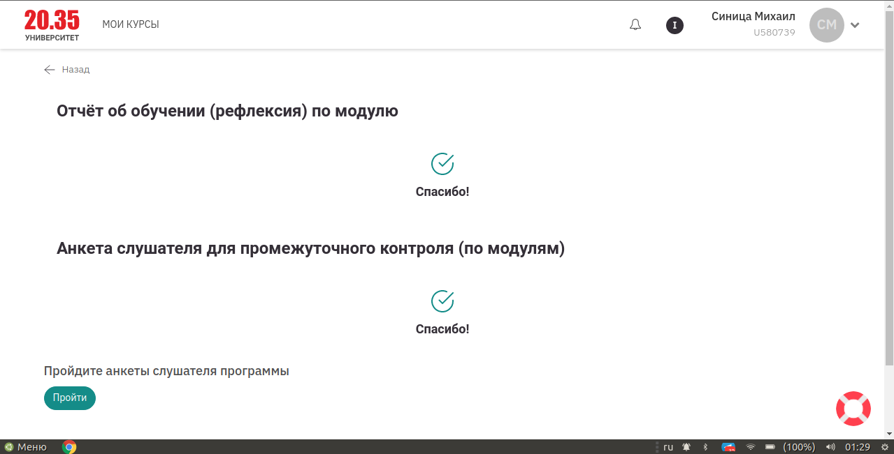
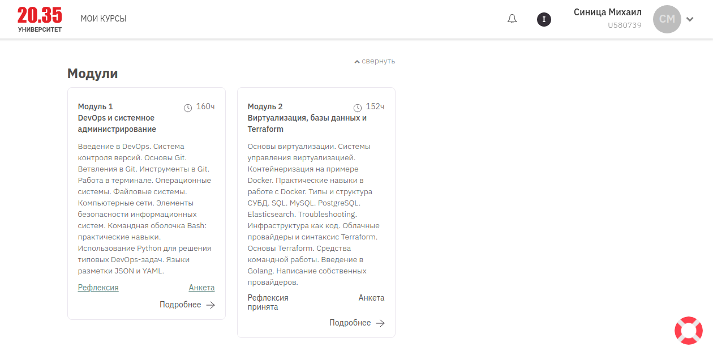
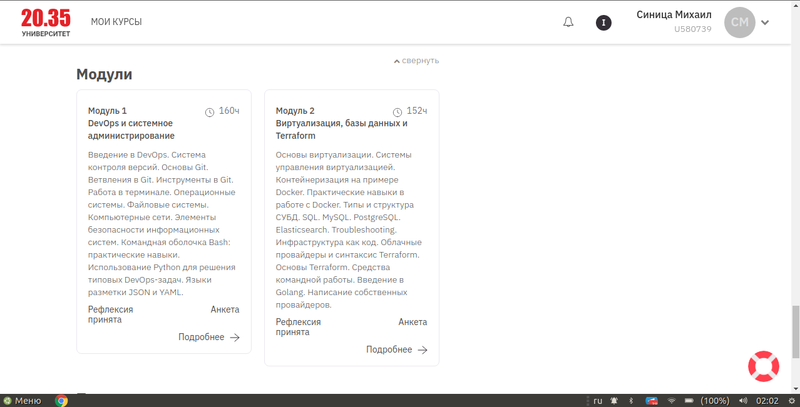

### Рефлексия по блоку "Виртуализация, базы данных и Terraform («Цифровые профессии»)"
Срок обучения: 14 января — 10 мая

### Рефлексия по модулю "DevOps и системное администрирование («Цифровые профессии»)" 

Срок обучения: 21 октября — 22 декабря

